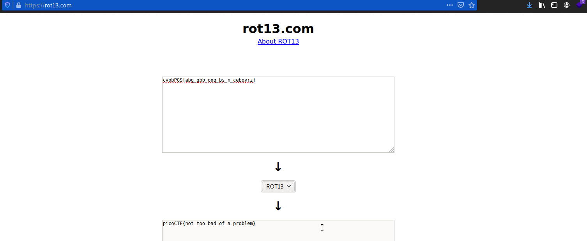

# 13
#### Points: 100

## Category
#### Cryptography

## Question
#### Cryptography can be easy, do you know what ROT13 is? cvpbPGS{arkg_gvzr_V'yy_gel_2_ebhaqf_bs_ebg13_hyLicInt}

### Hint
>#### This can be solved online if you don't want to do it by hand!

## Solution

#### The rot13 encoding is used here.Go to this website [rot13](https://rot13.com/ "rot13") and paste the text `cvpbPGS{arkg_gvzr_V'yy_gel_2_ebhaqf_bs_ebg13_hyLicInt}` to get the flag.  

## Flag
`picoCTF{not_too_bad_of_a_problem}`