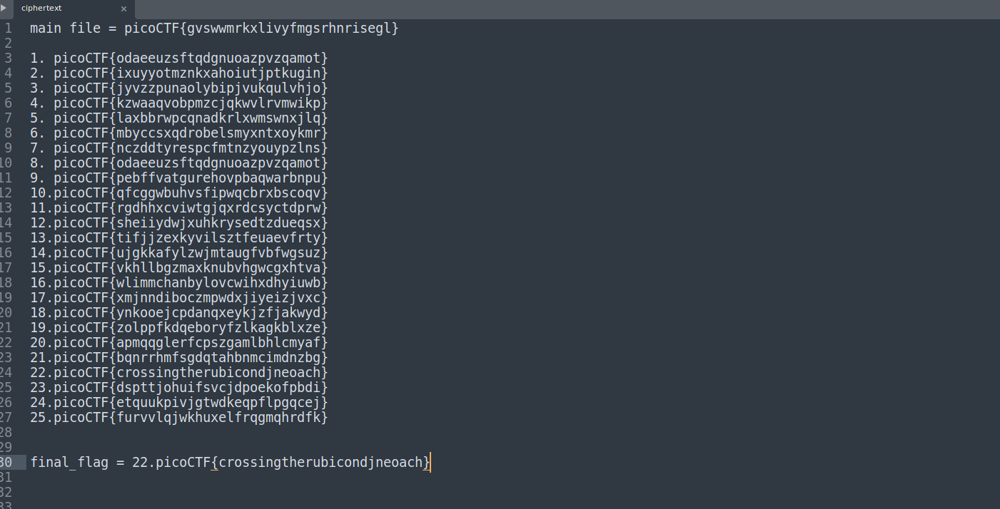

# caesar
#### Points: 100

## Category
#### Cryptography

## Question
#### Decrypt this [message](https://jupiter.challenges.picoctf.org/static/7d707a443e95054dc4cf30b1d9522ef0/ciphertext).

### Hint
>#### caesar cipher [tutorial](https://learncryptography.com/classical-encryption/caesar-cipher)

## Solution

#### As the title and hint of the problem suggest, this is encoded with a Caesar cipher, in which every character is shifted a number of times in the alphabet. Simple plug the flag from the file into an online tool such as [Cryptii](https://cryptii.com/pipes/caesar-cipher) and change the shifted value until the plain-text becomes a coherent message.

## Flag
`picoCTF{crossingtherubicondjneoach}`