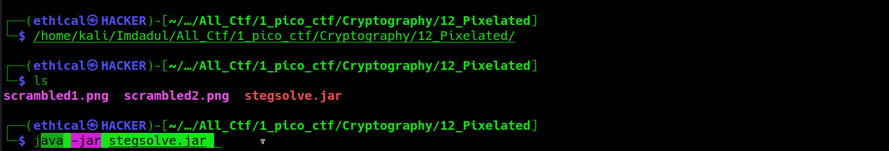
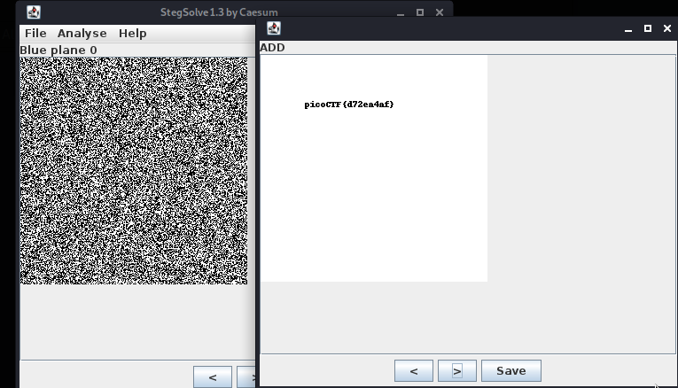

# Pixelated
#### Points: 100

## Category
#### Cryptography

## Question
#### I have these 2 images, can you make a flag out of them? [scrambled1.png](https://mercury.picoctf.net/static/e8054e22552c6aba591cdf7440eb25e4/scrambled1.png) [scrambled2.png](https://mercury.picoctf.net/static/e8054e22552c6aba591cdf7440eb25e4/scrambled2.png)

### Hint
>#### 1. https://en.wikipedia.org/wiki/Visual_cryptography
>#### 2. Think of different ways you can "stack" images

## Solution

#### Looking at the two images hints towards some sort of operation between them that will show the fag. To do so, I used stegsolve.jar and used the image overlay function.
## Method
#### By overlaying one image over another and cycling the overlay mode through stegsolve, was able to see flag.
## Download and use

#### After downloading, launch kali linux terminal and enter `java -jar stegsolve.jar`

## Flag
`picoCTF{d72ea4af}`