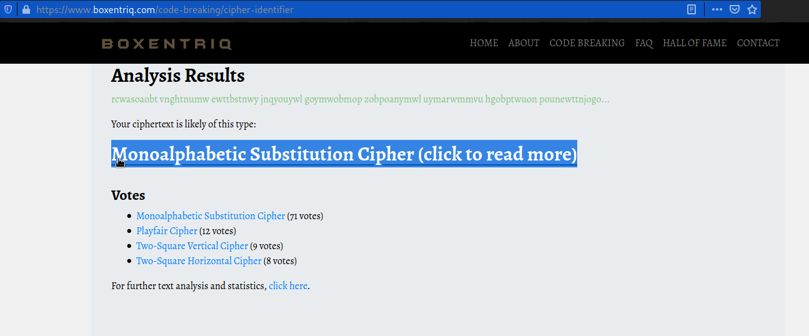

# Spelling-quiz
#### Points: 100

## Category
#### Cryptography

## Question
#### I found the flag, but my brother wrote a program to encrypt all his text files. He has a spelling quiz study guide too, but I don't know if that helps.

### Hint
>#### (None)

## Solution

#### First download the public.zip file, then unzip it. Second, open this file and open the study-guide.txt file, then copy all of the text.Finally, go to the [Boxentriq](https://www.boxentriq.com/code-breaking/cipher-identifier "boxentriq") website and analyse the ciphertext. 

#### The result of the analysis is Monoalphabetic Substitution Cipher encoding of text . click [Monoalphabetic Substitution Cipher (click to read more)](https://www.boxentriq.com/code-breaking/cipher-identifier#monoalphabetic-substitution-cipher)

#### Next, click [Monoalphabetic Substitution Cipher Tool](https://www.boxentriq.com/code-breaking/cryptogram)

#### Then copy flag.txt and paste it into this website to obtain the flag. 

## Flag
`picoCTF{perhaps the don jumped over was just tired}`