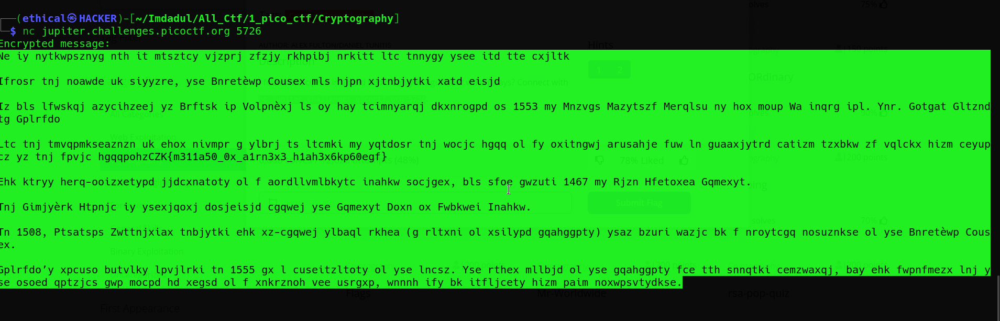
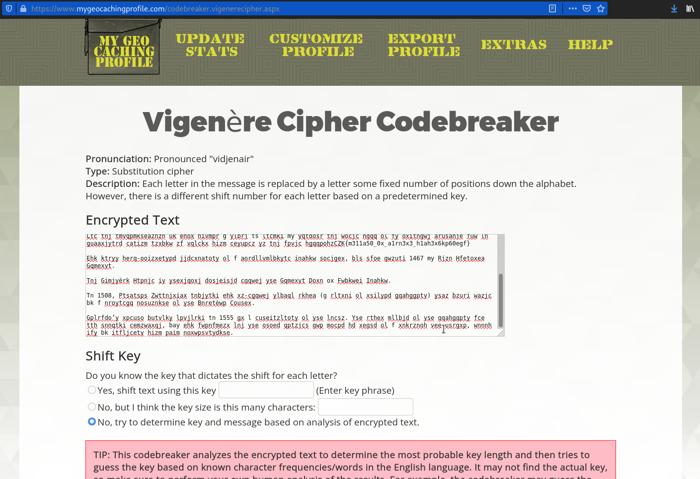
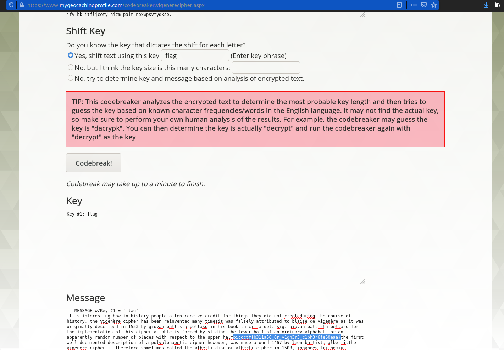

# la cifra de
Points: 200

## Category
Cryptography

## Question
#### I found this cipher in an old book. Can you figure out what it says? Connect with nc jupiter.challenges.picoctf.org 5726.

### Hint
>#### 1. There are tools that make this easy.
>#### 2. Perhaps looking at history will help

## Solution
#### Open the Kali linux terminal and type abcd, then copy all cypher text. 

#### After copying all of the encrypted text, paste this webpage [mygeocachingprofile](https://www.mygeocachingprofile.com/codebreaker.vigenerecipher.aspx) to receive the flag and type flag using the shift key. 

## Flag
`picoCTF{b311a50_0r_v1gn3r3_c1ph3r6fe60eaa}`