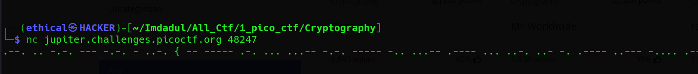

# Tapping
#### Points: 200

## Category
#### Cryptography

## Question
#### Theres tapping coming in from the wires. What's it saying nc jupiter.challenges.picoctf.org 48247.

### Hint
>#### What kind of encoding uses dashes and dots?
>#### The flag is in the format PICOCTF{}


## Solution

#### Open the Kali linux terminal and type abcd, then copy all morse code text. 
```bash
nc jupiter.challenges.picoctf.org 48247
.--. .. -.-. --- -.-. - ..-. { -- ----- .-. ... ...-- -.-. ----- -.. ...-- .---- ... ..-. ..- -. .---- ..--- -.... .---- ....- ...-- ---.. .---- ---.. .---- }
```


#### After copying all of the encrypted text, paste this webpage [gchq.github](https://gchq.github.io/CyberChef/#recipe=From_Morse_Code('Space','Line%20feed')&input=Li0tLiAuLiAtLi0uIC0tLSAtLi0uIC0gLi4tLiB7IC0tIC0tLS0tIC4tLiAuLi4gLi4uLS0gLS4tLiAtLS0tLSAtLi4gLi4uLS0gLi0tLS0gLi4uIC4uLS4gLi4tIC0uIC4tLS0tIC4uLS0tIC0uLi4uIC4tLS0tIC4uLi4tIC4uLi0tIC0tLS4uIC4tLS0tIC0tLS4uIC4tLS0tIH0) to receive the flag .


## Flag
`picoCTF{M0RS3C0D31SFUN1261438181}`