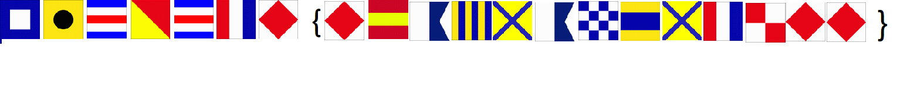
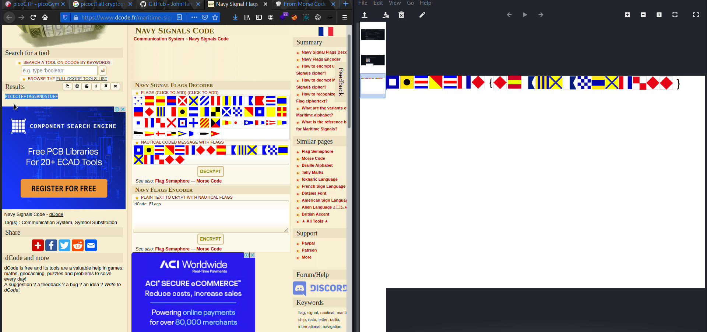

# Flags
Points: 200

## Category
Cryptography

## Question
#### What do the [flags](https://jupiter.challenges.picoctf.org/static/fbeb5f9040d62b18878d199cdda2d253/flag.png) mean?

### Hint
>#### The flag is in the format PICOCTF{}
## Description
#### View all flags by opening the flag.png file. . 

## Solution

#### Go to the [dcode](https://www.dcode.fr/maritime-signals-code) website and send one flag each to receive the flag 

## Flag
`picoCTF{MORS3C0D31SFUN1261438181}`