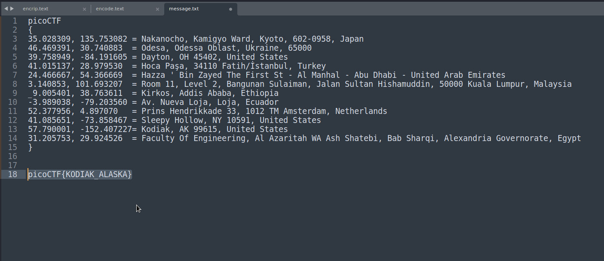

# Mr-Worldwide
#### Points: 200

## Category
#### Cryptography

## Question
#### A musician left us a [message](https://jupiter.challenges.picoctf.org/static/d5570d48262dbba2a31f2a940409ad9d/message.txt). What's it mean?
#### Look at this message.
```bash
picoCTF{(35.028309, 135.753082)(46.469391, 30.740883)(39.758949, -84.191605)(41.015137, 28.979530)(24.466667, 54.366669)(3.140853, 101.693207)_(9.005401, 38.763611)(-3.989038, -79.203560)(52.377956, 4.897070)(41.085651, -73.858467)(57.790001, -152.407227)(31.205753, 29.924526)}
```

### Hint
>#### (None)


## Solution

####  These look like coordinates. If take the first letter of the location matching each of the coordinates, we get:




```
[K]yoto             (35.028309, 135.753082)
[O]dessa            (46.469391, 30.740883)
[D]ayton            (39.758949, -84.191605)
[I]stanbul          (41.015137, 28.979530)
[A]bu Dhabi         (24.466667, 54.366669)
[K]uala Lumpur      (3.140853, 101.693207)
_
[A]ddis Ababa       (9.005401, 38.763611)
[L]oja              (-3.989038, -79.203560)
[A]msterdam         (52.377956, 4.897070)
[S]leepy Hollow     (41.085651, -73.858467)
[K]odiak            (57.790001, -152.407227)
[A]lexandria        (31.205753, 29.924526)
---------------------------------------------
```


## Flag
`picoCTF{KODIAK_ALANKA}`