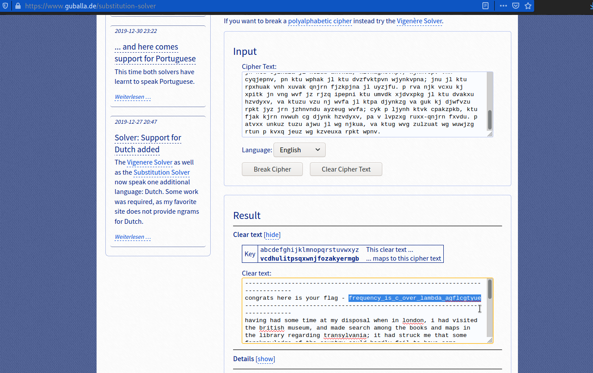

# Waves over lambda
#### Points: 300

## Category
#### Cryptography

## Question
#### We made a lot of substitutions to encrypt this. Can you decrypt it? Connect with nc jupiter.challenges.picoctf.org 39894.

### Hint
>#### Flag is not in the usual flag format

## Solution

#### The text encoding cyphers is used here. Go to this website [guballa](https://www.guballa.de/vigenere-solver "guballa") and paste the text, then select English as the language and get the flag. 

## Flag
`picoCTF{frequency_is_c_over_lambda_agflcgtyue}`