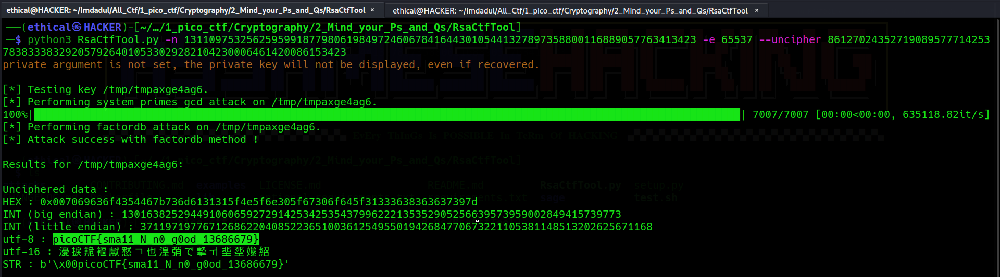

# Mind your Ps and Qs
Points: 20

## Category
Cryptography

## Question
#### In RSA, a small e value can be problematic, but what about N? Can you decrypt this? [values](https://mercury.picoctf.net/static/2604f8b51a5cc62d38a3736938f19cef/values "values")

### Hint
>#### Bits are expensive, I used only a little bit over 100 to save money

 
## Description
#### Fast download [values](https://mercury.picoctf.net/static/2604f8b51a5cc62d38a3736938f19cef/values "values") txt file .
#### Let's now read a text:
```bash
Decrypt my super sick RSA:
c: 861270243527190895777142537838333832920579264010533029282104230006461420086153423
n: 1311097532562595991877980619849724606784164430105441327897358800116889057763413423
e: 65537
```
## Solution
#### Quickly install a tool [RsaCtfTool](https://github.com/Ganapati/RsaCtfTool.git "RsaCtfTool")

### Installing :
```bash
git clone https://github.com/Ganapati/RsaCtfTool.git
sudo apt-get install libgmp3-dev libmpc-dev
cd RsaCtfTool
pip3 install -r "requirements.txt"
python3 RsaCtfTool.py
```
#### After installing go to RsaCtfTool folder then, follow this recommendation. Type :
```
python3 RsaCtfTool.py -n 1311097532562595991877980619849724606784164430105441327897358800116889057763413423 -e 65537 --uncipher 861270243527190895777142537838333832920579264010533029282104230006461420086153423
```

## Flag
`picoCTF{sma11_N_n0_g0od_13686679}`