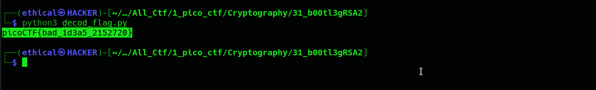

# b00tl3gRSA2
#### Points: 400

## Category
#### Cryptography

## Question
#### In RSA d is a lot bigger than e, why don't we use d to encrypt instead of e? Connect with nc jupiter.challenges.picoctf.org 57464.

### Hint
>#### What is e generally?
## Description
#### In the kali linux terminal, type `nc jupiter.challenges.picoctf.org 57464` and take a look at this.
```bash
c: 82923903335192438086913317033599917395711985262882270244314888469515966514693546168435025179019934019054501886768653399185120602576901438495069363926419537540633123147341669696860355904668483103632411817638129253423445931019012285756951512990508021329212429720859329045312118148754935154616259399307480334032

n: 84271805894431279886943500232972368956271746638328528553401233877811346079580342670552381255981964502517312250892251156959334738145978978596839814140789503620776926177154819057796530790952834154119567904392967854393401944698988770825127605712942854973137057331792783906999847703944470341077944874361044644203

e: 12512762914974911646548471867297162249011708905466757882618176096937336294007908731360074797472580322169094793985572974172929586903558622468618463332224887929695966453128538183572955410885490281448274785636019622314870690067664569872783287714382058330677483373149533893779972158219541237793423676863044940793


```


## Solution

#### Save `decode_flag.py` after copying all of the decode python code. 
```python

from Crypto.Util.number import long_to_bytes

c = 24671005237524713926353346277545930647178352298559668385932896012579109894122520377187768313208226992229285992848317140202626178774598340031249145139938679896088874021463220309428952912854564728583959962723694799495582232782493043171087707842755629255194315973794606626971669114495890354071890436563936897704
n = 105760530531025436955612311481084551141712020584860702340597133164102847123167169739434833136258478502812722552456582440826441500952079159122249429274963951295547928034458140096705407288335588156103842304787508857709281789494304255771075252823696091203106367301825364517994008390006948115589455754694509545101
d = 65537

print(long_to_bytes(pow(c, d, n)).decode())

```
#### Open the kali linux terminal and enter the command `python3 decode_flag.py`. Obtain the flag 


## Flag
`picoCTF{bad_1d3a5_2152720}`