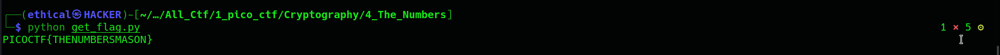
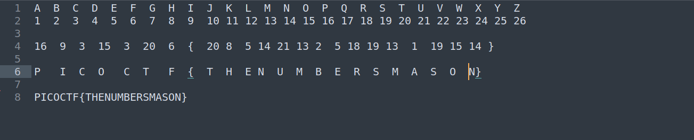

# The Numbers
Points: 50

## Category
Cryptography

## Question
#### The [numbers](https://jupiter.challenges.picoctf.org/static/f209a32253affb6f547a585649ba4fda/the_numbers.png)... what do they mean?

### Hint
>#### The flag is in the format PICOCTF{}


## Description
#### See this file after downloading the [numbers](https://jupiter.challenges.picoctf.org/static/f209a32253affb6f547a585649ba4fda/the_numbers.png) png file. 


 
## Solution
#### There are two types of solutions.
1. A python solution
2. Hand-crafted solution 
#### 1. a python solution
#### Copy the entire python code and save it as get get_flag.py 
```bash
#!/usr/bin/env python

from string import ascii_uppercase as uppercase

numbers = [
	16, 
	9, 
	3, 
	15, 
	3, 
	20, 
	6, 
	'{', 
	20, 
	8, 
	5, 
	14, 
	21, 
	13, 
	2, 
	5, 
	18, 
	19, 
	13, 
	1, 
	19, 
	15, 
	14, 
	'}',
]

flag = []
for n in numbers:
	if type(n) == str:
		flag.append(n)
	else:	
		flag.append(uppercase[n-1])

print(''.join(flag))		

```
#### then launch the terminal and enter the command `python get_flag.py` get the flag.


#### 2. Hand-crafted solution



## Flag
`PICOCTF{THENUMBERSMASON}`