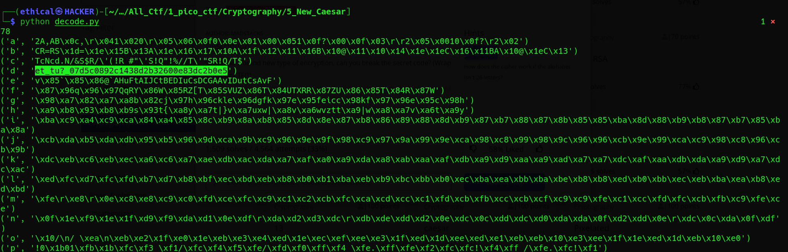

# New Caesar
Points: 60

## Category
Cryptography

## Question
#### We found a brand new type of encryption, can you break the secret code? (Wrap with picoCTF{}) 
#### dcebcmebecamcmanaedbacdaanafagapdaaoabaaafdbapdpaaapadanandcafaadbdaapdpandcac [new_caesar.py](https://mercury.picoctf.net/static/226a5ad9c9cb528673058d06d4c4380b/new_caesar.py "new_caesar.py")
### Hint
>#### 1. How does the cipher work if the alphabet isn't 26 letters?
>#### 2. Even though the letters are split up, the same paradigms still apply

## Description
#### Let's download the file: [new_caesar.py](https://mercury.picoctf.net/static/226a5ad9c9cb528673058d06d4c4380b/new_caesar.py "new_caesar.py")
#### Then read the python file new_casar.py :
```python
import string

LOWERCASE_OFFSET = ord("a")
ALPHABET = string.ascii_lowercase[:16]

def b16_encode(plain):
	enc = ""
	for c in plain:
		binary = "{0:08b}".format(ord(c))
		enc += ALPHABET[int(binary[:4], 2)]
		enc += ALPHABET[int(binary[4:], 2)]
	return enc

def shift(c, k):
	t1 = ord(c) - LOWERCASE_OFFSET
	t2 = ord(k) - LOWERCASE_OFFSET
	return ALPHABET[(t1 + t2) % len(ALPHABET)]

flag = "redacted"
key = "redacted"
assert all([k in ALPHABET for k in key])
assert len(key) == 1

b16 = b16_encode(flag)
enc = ""
for i, c in enumerate(b16):
	enc += shift(c, key[i % len(key)])
print(enc)

```


## Solution
#### Copy the entire python code and save it as get decode.py
```python
import string

LOWERCASE_OFFSET = ord("a")
ALPHABET = string.ascii_lowercase[:16]

def b16_decode(plain):
	enc = ""
	for c in plain:
		binary = "{0:08b}".format(ord(c))
		enc += ALPHABET[int(binary[:4], 2)]
		enc += ALPHABET[int(binary[4:], 2)]
	return enc
	
def b16_decode(cipher):
	enc = ""
	for i in range(0,len(cipher),2):
		binary = "{0:04b}".format(ALPHABET.index(cipher[i]))+"{0:04b}".format(ALPHABET.index(cipher[i+1]))
		enc += chr(int(binary,2))
	return enc

def shift(c, k):
	t1 = ord(c) - LOWERCASE_OFFSET
	t2 = ord(k) - LOWERCASE_OFFSET
	return ALPHABET[(t1 + t2) % len(ALPHABET)]

encflag = "dcebcmebecamcmanaedbacdaanafagapdaaoabaaafdbapdpaaapadanandcafaadbdaapdpandcac"

#assert all([k in ALPHABET for k in key])
#assert len(key) == 1

print(len(encflag))
for key in ALPHABET:
	dec = ""
	for  c in encflag:
		dec += shift(c,key)
	b16 = b16_decode(dec)
	print(key,b16)
```
#### Then launch the terminal and enter the command `python decode.py` get the flag.



## Flag
`picoCTF{et_tu?_07d5c0892c1438d2b32600e83dc2b0e5}`