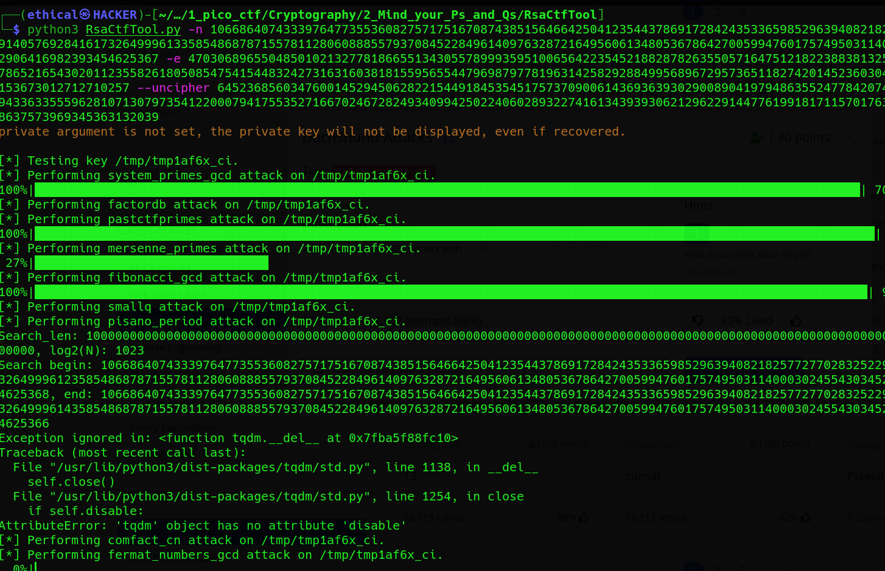

# Mind your Ps and Qs
Points: 20

## Category
Cryptography

## Question
#### In RSA, a small e value can be problematic, but what about N? Can you decrypt this? [values](https://mercury.picoctf.net/static/2604f8b51a5cc62d38a3736938f19cef/values "values")

### Hint
>#### Bits are expensive, I used only a little bit over 100 to save money

 
## Description
#### Fast download [values](https://mercury.picoctf.net/static/2604f8b51a5cc62d38a3736938f19cef/values "values") txt file .
#### Let's now read a text:
```bash
Welcome to my RSA challenge!
e: 29008921796790739003668570502699693902290847652190804284692082087861000110139423050971997123774442940436238952504370879673038348596498186533995879653554928361525523379393929547607860769687442834766260368675644525856607845300965682180089200394418194024988575448953700328189920286233350971893124558484096835281
n: 62130206514411443152064620172716072709291934578608243348425033491870699928963420797070602344358375659460999454889337721875597620204219913975330526119314177888883524990279162899126071140663629760948196224740592177315148076970672312875218261406309161887533098991828036390925679693790095155598638821607350541387
c: 26686479740354870433752476740004157322316954574955698950381189424568722099936518317955259713492048328592178482799929281939107549818605450400771421089688643568138745627891176272054819629482918431375643580767248647718128332475062094007632077337561914586541940400853098562566297766358634067110981066168580544486
```
## Solution
#### Quickly install a tool [RsaCtfTool](https://github.com/Ganapati/RsaCtfTool.git "RsaCtfTool")

### Installing :
```bash
git clone https://github.com/Ganapati/RsaCtfTool.git
sudo apt-get install libgmp3-dev libmpc-dev
cd RsaCtfTool
pip3 install -r "requirements.txt"
python3 RsaCtfTool.py
```
#### After installing go to RsaCtfTool folder then, follow this recommendation. Type :
```
python3 RsaCtfTool.py -n 62130206514411443152064620172716072709291934578608243348425033491870699928963420797070602344358375659460999454889337721875597620204219913975330526119314177888883524990279162899126071140663629760948196224740592177315148076970672312875218261406309161887533098991828036390925679693790095155598638821607350541387 -e 29008921796790739003668570502699693902290847652190804284692082087861000110139423050971997123774442940436238952504370879673038348596498186533995879653554928361525523379393929547607860769687442834766260368675644525856607845300965682180089200394418194024988575448953700328189920286233350971893124558484096835281 --uncipher 26686479740354870433752476740004157322316954574955698950381189424568722099936518317955259713492048328592178482799929281939107549818605450400771421089688643568138745627891176272054819629482918431375643580767248647718128332475062094007632077337561914586541940400853098562566297766358634067110981066168580544486
```


## Flag
`picoCTF{proving_wiener_8652838}`