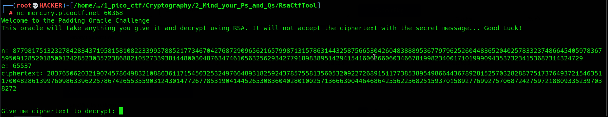
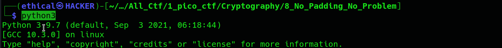
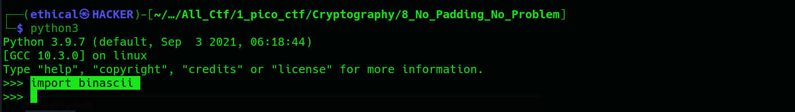
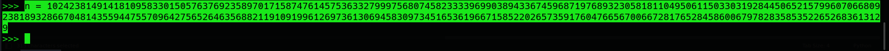
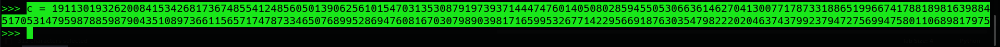
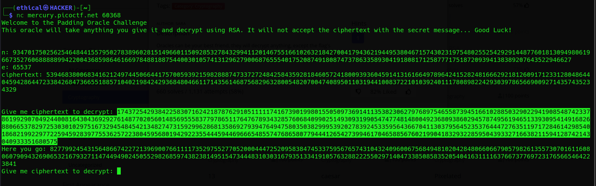
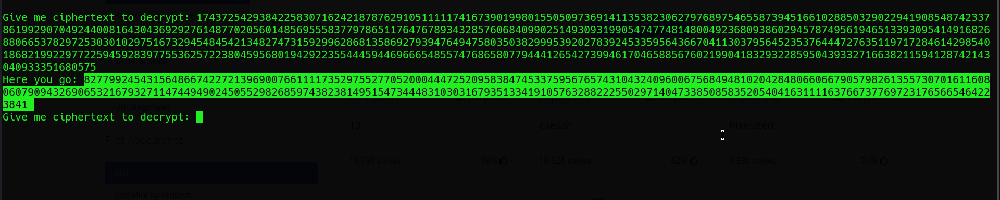
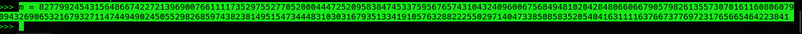
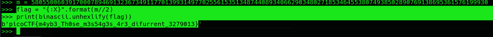

# No Padding, No Problem
#### Points: 90

## Category
#### Cryptography

## Question
#### Oracles can be your best friend, they will decrypt anything, except the flag's ciphertext. How will you break it? Connect with nc mercury.picoctf.net 60368.


### Hint
>#### What can you do with a different pair of ciphertext and plaintext? What if it is not so different after all...
## Solution

#### Let's connect to the attached server:

```console
┌──(user@kali)-[/media/sf_CTFs/pico/No_Padding_No_Problem]
└─$ nc mercury.picoctf.net 30048
Welcome to the Padding Oracle Challenge
This oracle will take anything you give it and decrypt using RSA. It will not accept the ciphertext with the secret message... Good Luck!


n: 102423814914181095833015057637692358970171587476145753633279997568074582333396990389433674596871976893230581811049506115033031928445065215799607066809238189328667048143559447557096427565264635688211910919961269736130694583097345165361966715852202657359176047665670066728176528458600679782835853522652683613129
e: 65537
ciphertext: 19113019326200841534268173674855412485605013906256101547031353087919739371444747601405080285945505306636146270413007717873318865199667417881898163988451705314795987885987904351089736611565717478733465076899528694760816703079890398171659953267714229566918763035479822202046374379923794727569947580110689817975


Give me ciphertext to decrypt: 
```

#### We get some RSA values and the ability to decrypt any ciphertext... Except for the provided ciphertext, that is:

```
Give me ciphertext to decrypt: 4630900525813217788908324506108030714601444705261980401094718094759603138876572869225585464832937171107712654868912146981974620187638194979958086597403998901460677636640013168017847942623819676132193036153903064536382635689292213133256195449181769142311263486211152780709880862212814932262615707105931438936
Will not decrypt the ciphertext. Try Again
```

#### Now, unpadded RSA is [homomorphic](https://en.wikipedia.org/wiki/Homomorphic_encryption), which means that:

```
encrypt(m1) * encrypt(m2) = ((m1**e) * (m2**e)) mod n = (m1 * m2)**e mod n = encrypt(m1 * m2)
```

#### So, we can take a known value such as `2`, and encrypt it by performing `2**e mod n`.

```python
>>> n = 102423814914181095833015057637692358970171587476145753633279997568074582333396990389433674596871976893230581811049506115033031928445065215799607066809238189328667048143559447557096427565264635688211910919961269736130694583097345165361966715852202657359176047665670066728176528458600679782835853522652683613129
>>> e = 65537
>>> c = 19113019326200841534268173674855412485605013906256101547031353087919739371444747601405080285945505306636146270413007717873318865199667417881898163988451705314795987885987904351089736611565717478733465076899528694760816703079890398171659953267714229566918763035479822202046374379923794727569947580110689817975
>>> x = pow(2, e, n) * c
```







#### As explained earlier, `c * x = encrypt(m) * encrypt(2) = encrypt(m * 2)`.

#### Let's try to decrypt that:

```
Give me ciphertext to decrypt: 100143595101097482592830943996394084935896483190946501375900036789656563468161771661159361446264540870562875321563459868013559419801317017795671701911596839916318680717002043340397523992749301372798696850257395023843247887528117688037460937112899173181293401186268292785004213926734919791665692392466430105479585506366934056729120410715233430015617324382399879565964709375420317296313695324694080441459057761080942252174906527624295046338332389255727665817282665574808829804572524114287684014904494989016474124730841293049413485569031168274716135702636601427701120705065779700896004485699711505643761704463675796224
Here you go: 580550060391700078946913236734911770139931497702556153513487440893406629034802718534645538074938502890769425795379846471930
```



#### We got `m * 2`. We take the result and divide back by `2` to get `m`:

```python
>>> m = 580550060391700078946913236734911770139931497702556153513487440893406629034802718534645538074938502890769425795379846471930 // 2
```

#### Format that and get the flag:

```python
>>> bytearray.fromhex(format(m, 'x')).decode()
'picoCTF{m4yb3_Th0se_m3s54g3s_4r3_difurrent_5052620}'
```


## Flag
`picoCTF{m4yb3_Th0se_m3s54g3s_4r3_difurrent_5052620}`