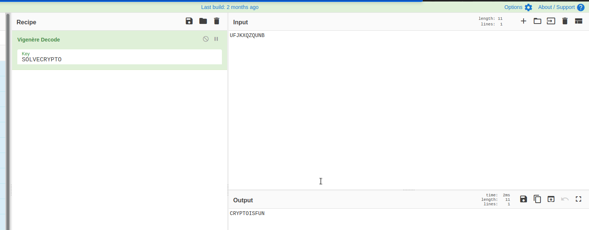
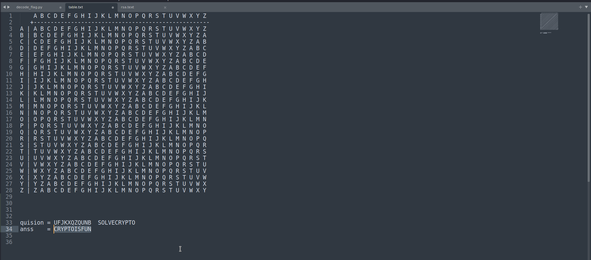

# Easy1
#### Points: 100

## Category
#### Cryptography

## Question
#### The one time pad can be cryptographically secure, but not when you know the key. Can you solve this? We've given you the encrypted flag, key, and a table to help UFJKXQZQUNB with the key of SOLVECRYPTO. Can you use this [table](https://jupiter.challenges.picoctf.org/static/1fd21547c154c678d2dab145c29f1d79/table.txt) to solve it?. 


### Hint
>#### 1. Submit your answer in our flag format. For example, if your answer was 'hello', you would submit 'picoCTF{HELLO}' as the flag.
>#### 2. Please use all caps for the message.
## Description
```
    A B C D E F G H I J K L M N O P Q R S T U V W X Y Z 
   +----------------------------------------------------
A | A B C D E F G H I J K L M N O P Q R S T U V W X Y Z
B | B C D E F G H I J K L M N O P Q R S T U V W X Y Z A
C | C D E F G H I J K L M N O P Q R S T U V W X Y Z A B
D | D E F G H I J K L M N O P Q R S T U V W X Y Z A B C
E | E F G H I J K L M N O P Q R S T U V W X Y Z A B C D
F | F G H I J K L M N O P Q R S T U V W X Y Z A B C D E
G | G H I J K L M N O P Q R S T U V W X Y Z A B C D E F
H | H I J K L M N O P Q R S T U V W X Y Z A B C D E F G
I | I J K L M N O P Q R S T U V W X Y Z A B C D E F G H
J | J K L M N O P Q R S T U V W X Y Z A B C D E F G H I
K | K L M N O P Q R S T U V W X Y Z A B C D E F G H I J
L | L M N O P Q R S T U V W X Y Z A B C D E F G H I J K
M | M N O P Q R S T U V W X Y Z A B C D E F G H I J K L
N | N O P Q R S T U V W X Y Z A B C D E F G H I J K L M
O | O P Q R S T U V W X Y Z A B C D E F G H I J K L M N
P | P Q R S T U V W X Y Z A B C D E F G H I J K L M N O
Q | Q R S T U V W X Y Z A B C D E F G H I J K L M N O P
R | R S T U V W X Y Z A B C D E F G H I J K L M N O P Q
S | S T U V W X Y Z A B C D E F G H I J K L M N O P Q R
T | T U V W X Y Z A B C D E F G H I J K L M N O P Q R S
U | U V W X Y Z A B C D E F G H I J K L M N O P Q R S T
V | V W X Y Z A B C D E F G H I J K L M N O P Q R S T U
W | W X Y Z A B C D E F G H I J K L M N O P Q R S T U V
X | X Y Z A B C D E F G H I J K L M N O P Q R S T U V W
Y | Y Z A B C D E F G H I J K L M N O P Q R S T U V W X
Z | Z A B C D E F G H I J K L M N O P Q R S T U V W X Y
```


## Solution

#### ## Solution
#### Two Type of solution :
#### Fast this is a classic [Vigenère cipher](https://en.wikipedia.org/wiki/Vigen%C3%A8re_cipher). It's easily solvable using any online decoder, such as [Cyberchef](https://gchq.github.io/CyberChef/#recipe=Vigen%C3%A8re_Decode('SOLVECRYPTO')&input=VUZKS1hRWlFVTkI).


#### Secend in order to decode the message manually, we use the following algorithm:

* For each letter in the key:
  * Find the row corresponding the the letter
  * In the row, find the column which contains the matching ciphertext letter
  * The matching plaintext letter is noted at the top of the column



## Flag
`picoCTF{CRYPTOISFUN}`