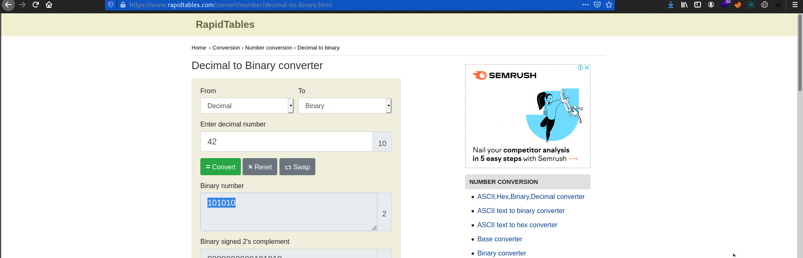

# 2Warm
Points: 50 

## Category
General Skills

## Question

#### Can you convert the number 42 (base 10) to binary (base 2)? 
### Hint

>#### Submit your answer in our competition's flag format. For example, if your answer was '11111', you would submit 'picoCTF{11111}' as the flag.
## Solution

copy `42` then go to the [rapidtables](https://www.rapidtables.com/convert/number/decimal-to-binary.html) site and paste the hex number 

### Flag
`picoCTF{101010}`