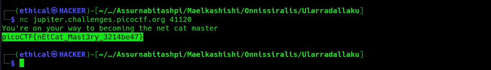

# What's a Net Cat?
Points: 100

## Category
General Skills

## Question
#### Using netcat (nc) is going to be pretty important. Can you connect to jupiter.challenges.picoctf.org at port 41120 to get the flag?

### Hint
>#### nc [tutorial](https://linux.die.net/man/1/nc)
## Solution

#### Open a terminal Kali and type the following command `nc jupiter.challenges.picoctf.org 41120` and obtained the flag . 

### Flag
`picoCTF{nEtCat_Mast3ry_3214be47}`