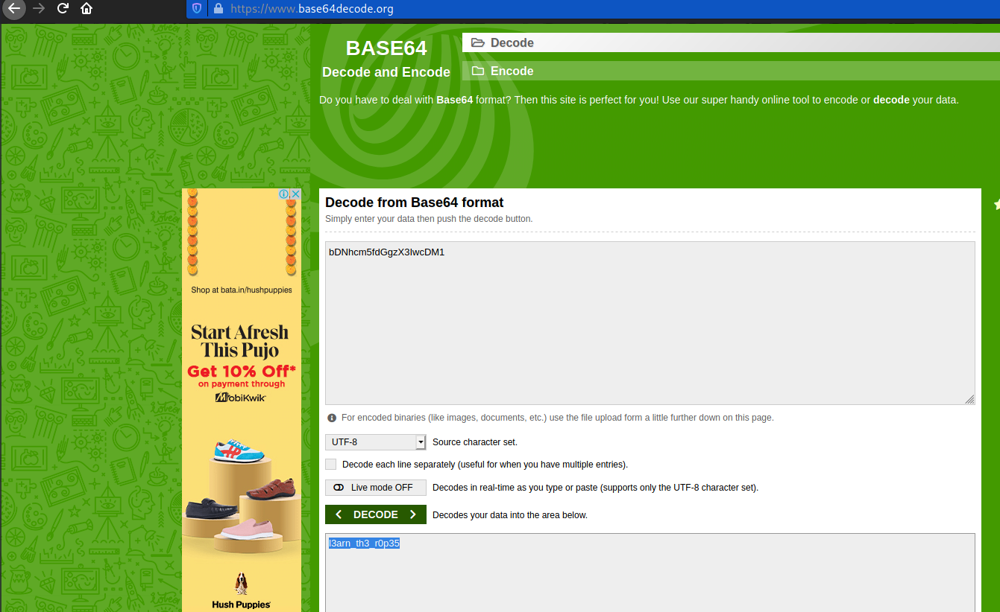

# Bases
Points: 

## Category
General Skills

## Question
#### What does this bDNhcm5fdGgzX3IwcDM1 mean? I think it has something to do with bases.

### Hint
>#### Submit your answer in our flag format. For example, if your answer was 'hello', you would submit 'picoCTF{hello}' as the flag.
## Solution

#### Copy `bDNhcm5fdGgzX3IwcDM1`, then paste it into the [base64decode](https://www.base64decode.org/ "base64decode") site to receive the flag .

#### Flag
`picoCTF{l3arn_th3_r0p35}`