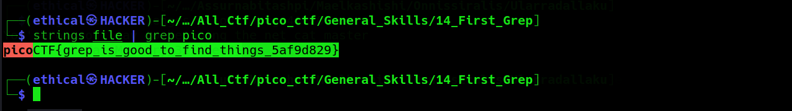

# First Grep
Points: 

## Category
General Skills

## Question
Can you find the flag in [file](https://jupiter.challenges.picoctf.org/static/515f19f3612bfd97cd3f0c0ba32bd864/file "file")? This would be really tedious to look through manually, something tells me there is a better way.

### Hint
>#### grep [tutorial](https://ryanstutorials.net/linuxtutorial/grep.php)
## Solution

#### Download the [file](https://jupiter.challenges.picoctf.org/static/515f19f3612bfd97cd3f0c0ba32bd864/file "file") file and open the Kali linux terminal, then enter this commend `strings file | grep pico` get the flag .

### Flag
`picoCTF{grep_is_good_to_find_things_5af9d829}`