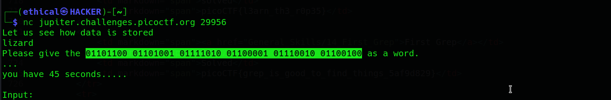

# Based
#### Points: 200

## Category
#### General Skills

## Question
#### To get truly 1337, you must understand different data encodings, such as hexadecimal or binary. Can you get the flag from this program to prove you are on the way to becoming 1337? Connect with nc jupiter.challenges.picoctf.org 29956.

### Hint

>#### 1. I hear python can convert things.
>#### 2. It might help to have multiple windows open.
## Solution

#### Pay attention that this challenge change each time so it’s not exactly the solution for you, but it’s the same way to solve it.

#### So lets connect to the server with netcat to see what it is:
` Open terminal -> nc 2019shell1.picoctf.com 29594 `
#### We can see this text:
` Let us see how data is stored table Please give the 01110100 01100001 01100010 01101100 01100101 as a word. … you have 45 seconds….. Input: `

#### and it’s wait for us to input a text from this binary number. So it’s one of the picoCTF nc quizzes, some of the solvers like to create a python script that parse the text and solve each level, but I think it’s just waste of time so I solve the levels manually.
#### So at the first level we need to convert binary base number to text, easy search in google found this [site](https://www.rapidtables.com/convert/number/ascii-hex-bin-dec-converter.html "site") And we got: table

#### Now I got this message: 
` Please give me the  143 150 141 151 162 as a word. `

#### So it’s not a binary now, the common bases are (binary, octal, decimal, hex) so binary no maybe it’s octal, again easy search in google found this [site](http://www.unit-conversion.info/texttools/octal/) And we got: nurse

#### Now the message is:

` Please give me the 6f76656e as a word. Input: `

So it’s not binary, not octal, not decimal so maybe it’s hex. Again easy search for hex to ascii and found this [site](https://www.rapidtables.com/convert/number/ascii-hex-bin-dec-converter.html "site") And we got: lizard

#### And here is the flag!

### Flag
`picoCTF{learning_about_converting_values_b375bb16}`