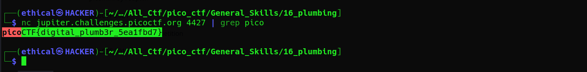

# Plumbing
Points: 200

## Category
General Skills

## Question
#### Sometimes you need to handle process data outside of a file. Can you find a way to keep the output from this program and search for the flag? Connect to jupiter.challenges.picoctf.org 4427.

### Hint
>#### 1. Remember the flag format is picoCTF{XXXX}
>#### 2. What's a pipe? No not that kind of pipe... This [kind](http://www.linfo.org/pipes.html)
## Solution

#### Open a Kali linux terminal and type `nc jupiter.challenges.picoctf.org 4427 | grep pico` get the flag.

## Flag
`picoCTF{digital_plumb3r_5ea1fbd7}`