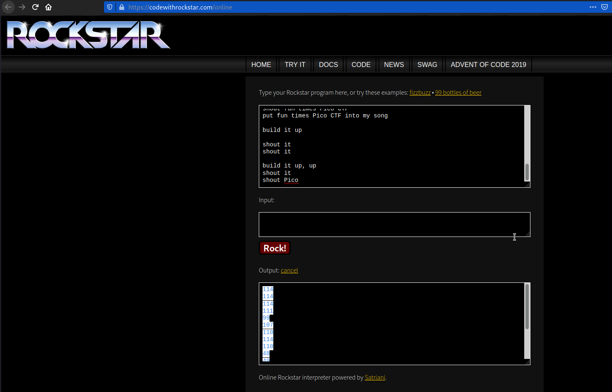
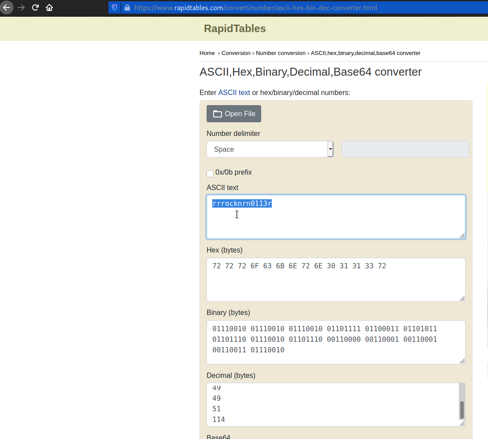

# Mus1c
#### Points: 300

## Category
#### General Skills

## Question
#### I wrote you a [song](https://jupiter.challenges.picoctf.org/static/0e21e3ca94779f56b122296424e879f8/lyrics.txt). Put it in the picoCTF{} flag format.

### Hint
#### Do you think you can master rockstar?
## Solution

#### Download the song file, open it, and copy all of the text. Then go to the [rockstar](https://codewithrockstar.com/online) website and paste it there. 

#### We can see this output text:

#### It is a decimal number. Copy all of the text. Then go to the rapidtables website and paste it there. and you'll get the flag. 

## Flag
`picoCTF{rrr0cknrn0113r}`