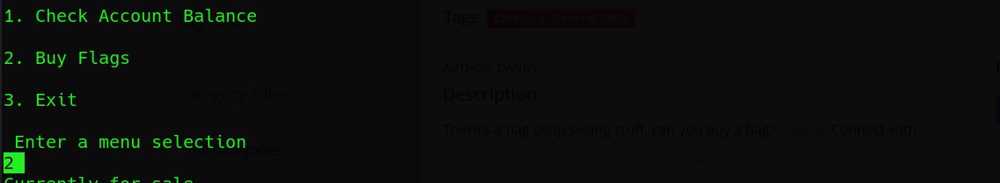

# Flag_shop
#### Points: 300

## Category
#### General Skills

## Question
#### There's a flag shop selling stuff, can you buy a flag? [Source](https://jupiter.challenges.picoctf.org/static/253c4651d852ac6342752ff222cf2a83/store.c). Connect with nc jupiter.challenges.picoctf.org 9745.

### Hint
>#### Two's compliment can do some weird things when numbers get really big!
## Solution

#### Let's download the file: [Source](https://jupiter.challenges.picoctf.org/static/253c4651d852ac6342752ff222cf2a83/store.c)

```bash
wget https://2019shell1.picoctf.com/static/cf15b93155d8b2361ca2fc2c61ee4d5f/store.c

```
#### Now, let's take a look:

```bash
#include <stdio.h>
#include <stdlib.h>
int main()
{
    setbuf(stdout, NULL);
    int con;
    con = 0;
    int account_balance = 1100;
    while(con == 0){
        
        printf("Welcome to the flag exchange\n");
        printf("We sell flags\n");

        printf("\n1. Check Account Balance\n");
        printf("\n2. Buy Flags\n");
        printf("\n3. Exit\n");
        int menu;
        printf("\n Enter a menu selection\n");
        fflush(stdin);
        scanf("%d", &menu);
        if(menu == 1){
            printf("\n\n\n Balance: %d \n\n\n", account_balance);
        }
        else if(menu == 2){
            printf("Currently for sale\n");
            printf("1. Defintely not the flag Flag\n");
            printf("2. 1337 Flag\n");
            int auction_choice;
            fflush(stdin);
            scanf("%d", &auction_choice);
            if(auction_choice == 1){
                printf("These knockoff Flags cost 900 each, enter desired quantity\n");
                
                int number_flags = 0;
                fflush(stdin);
                scanf("%d", &number_flags);
                if(number_flags > 0){
                    int total_cost = 0;
                    total_cost = 900*number_flags;
                    printf("\nThe final cost is: %d\n", total_cost);
                    if(total_cost <= account_balance){
                        account_balance = account_balance - total_cost;
                        printf("\nYour current balance after transaction: %d\n\n", account_balance);
                    }
                    else{
                        printf("Not enough funds to complete purchase\n");
                    }
                                    
                    
                }
                    
                    
                    
                
            }
            else if(auction_choice == 2){
                printf("1337 flags cost 100000 dollars, and we only have 1 in stock\n");
                printf("Enter 1 to buy one");
                int bid = 0;
                fflush(stdin);
                scanf("%d", &bid);
                
                if(bid == 1){
                    
                    if(account_balance > 100000){
                        FILE *f = fopen("flag.txt", "r");
                        if(f == NULL){

                            printf("flag not found: please run this on the server\n");
                            exit(0);
                        }
                        char buf[64];
                        fgets(buf, 63, f);
                        printf("YOUR FLAG IS: %s\n", buf);
                        }
                    
                    else{
                        printf("\nNot enough funds for transaction\n\n\n");
                    }}

            }
        }
        else{
            con = 1;
        }

    }
    return 0;
}
```
#### Lets try to understand. We can see out balance, and buy fake/real flags. fake costs 900 and real costs 100000. We need the real flag.

#### Fast open a kali linux Terminal and type `nc jupiter.challenges.picoctf.org 9745`   


#### After that, enter number 2

#### The next type is type 2 .

#### The next type is type 2386192 .

#### The next type is type  1.

#### Type 2 after that type 2 and get the flag 

## Flag
`picoCTF{m0n3y_bag5_65d67a74}`