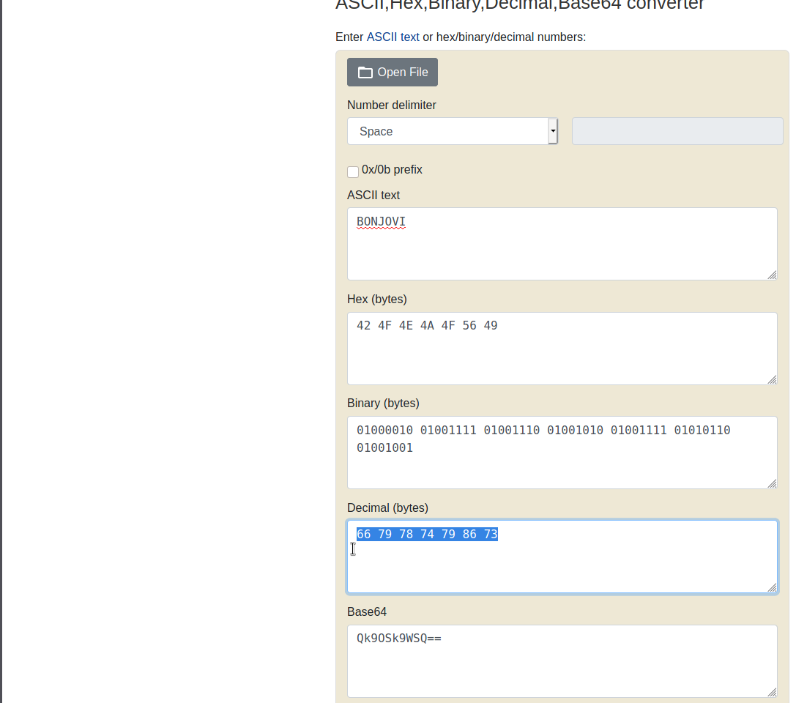

# 1_wanna_b3_a_r0ck5tar
Points: 

## Category
General Skills

## Question
#### I wrote you another [song](https://jupiter.challenges.picoctf.org/static/62f0cc3605aaf108a4f743b5b7f0dac4/lyrics.txt "song"). Put the flag in the picoCTF{} flag format

### Hint
>#### (None)

## Description
#### Let's download the file: [song.](https://jupiter.challenges.picoctf.org/static/62f0cc3605aaf108a4f743b5b7f0dac4/lyrics.txt "song")

```bash
wget https://jupiter.challenges.picoctf.org/static/62f0cc3605aaf108a4f743b5b7f0dac4/lyrics.txt

```
#### Let's now read a text:
```bash
Rocknroll is right              
Silence is wrong                
A guitar is a six-string        
Tommy's been down               
Music is a billboard-burning razzmatazz!
Listen to the music             
If the music is a guitar                  
Say "Keep on rocking!"                
Listen to the rhythm
If the rhythm without Music is nothing
Tommy is rockin guitar
Shout Tommy!                    
Music is amazing sensation 
Jamming is awesome presence
Scream Music!                   
Scream Jamming!                 
Tommy is playing rock           
Scream Tommy!       
They are dazzled audiences                  
Shout it!
Rock is electric heaven                     
Scream it!
Tommy is jukebox god            
Say it!                                     
Break it down
Shout "Bring on the rock!"
Else Whisper "That ain't it, Chief"                 
Break it down 

```
## Solution

#### Quickly install a tool [rockstar](https://github.com/yyyyyyyan/rockstar-py "rockstar")

### Installing
```bash
git clone https://github.com/yyyyyyyan/rockstar-py.git
cd rockstar-py
python3 setup.py install
```
#### After installing, follow this recommendation. Type `rockstar-py -i lyrics.txt`

#### Now, let's take a look python:
```bash
Rocknroll = True
Silence = False
a_guitar = 10
Tommy = 44
Music = 170
the_music = input()
if the_music == a_guitar:
    print("Keep on rocking!")
    the_rhythm = input()
    if the_rhythm - Music == False:
        Tommy = 66
        print(Tommy!)
        Music = 79
        Jamming = 78
        print(Music!)
        print(Jamming!)
        Tommy = 74
        print(Tommy!)
        They are dazzled audiences
        print(it!)
        Rock = 86
        print(it!)
        Tommy = 73
        print(it!)
        break
        print("Bring on the rock!")
        Else print("That ain't it, Chief")
        break

```
#### Output number :
```bash
66
79
78
74
79
86
73
```
#### It is a decimal number and This website needs to be decoded : [rapidtables](https://www.rapidtables.com/convert/number/ascii-hex-bin-dec-converter.html "rapidtables")


## Flag
`picoCTF{BONJOVI}`