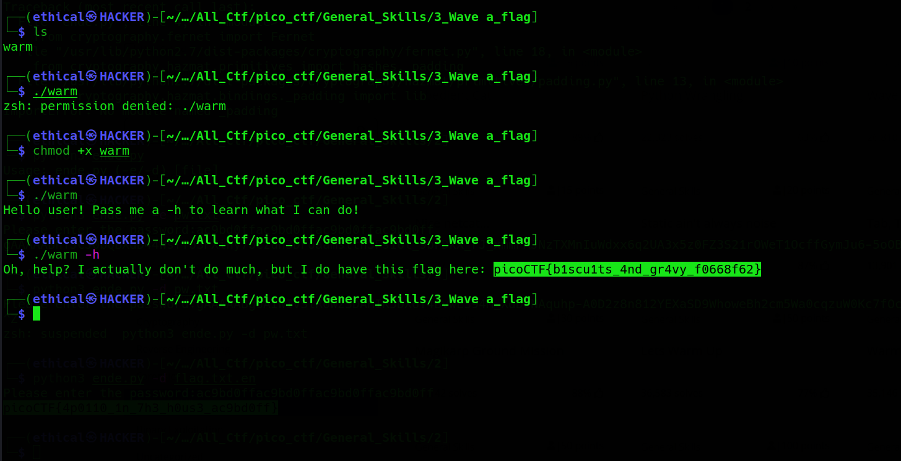

# Wave a Flag
Points: 10

## Category
General Skills

## Question
>Can you invoke help flags for a tool or binary? [This program](https://mercury.picoctf.net/static/f95b1ee9f29d631d99073e34703a2826/warm) has extraordinarily helpful information... 

### Hint
>1. This program will only work in the webshell or another Linux computer.

>2. To get the file accessible in your shell, enter the following in the Terminal prompt: $ wget https://mercury.picoctf.net/static/f95b1ee9f29d631d99073e34703a2826/warmt https://mercury.picoctf.net/static/325a52d249be0bd3811421eacd2c877a/ende.py

>3. Run this program by entering the following in the Terminal prompt: $ ./warm, but you'll first have to make it executable with $ chmod +x warm

>4. -h and --help are the most common arguments to give to programs to get more information from them!

>5. Not every program implements help features like -h and --help.
## Solution

Type the following commendation after downloading the warm file.

### Flag
`picoCTF{b1scu1ts_4nd_gr4vy_f0668f62}`
