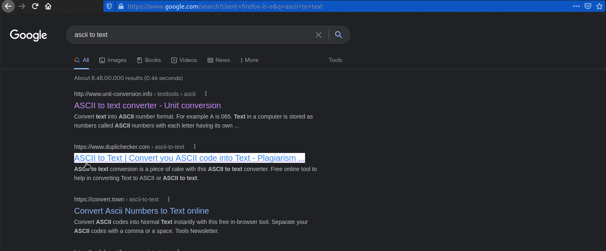
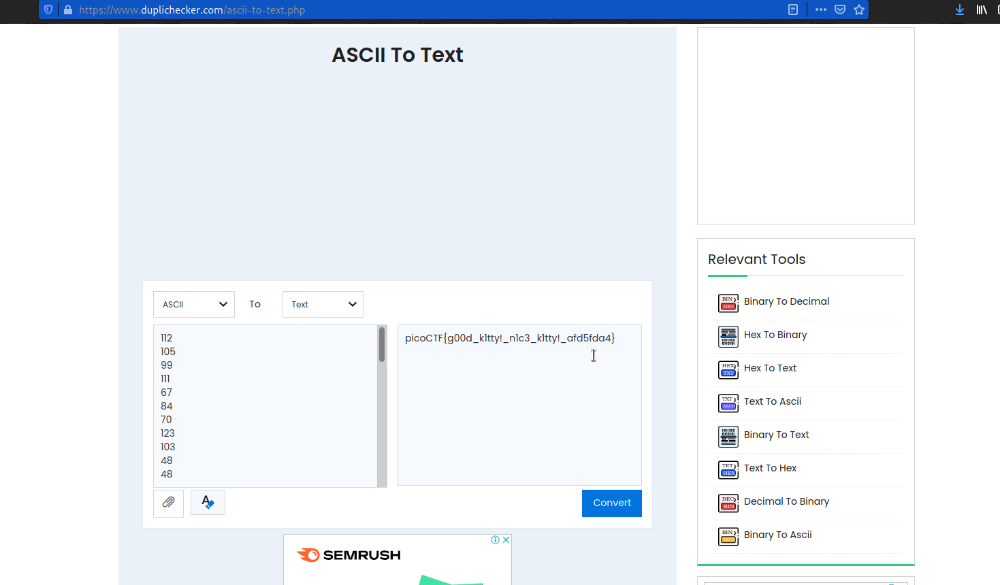

# Nice netcat...
Points: 15

## Category
General Skills

## Question
There is a nice program that you can talk to by using this command in a shell: $ nc mercury.picoctf.net 21135, but it doesn't speak English...

### Hint
>1. You can practice using netcat with this picoGym problem: [what's a netcat?](https://play.picoctf.org/practice/challenge/34)

>2. You can practice reading and writing ASCII with this picoGym problem: [Let's Warm Up](https://play.picoctf.org/practice/challenge/22)

## Solution
Use the kali linux terminal to type this command nc mercury.picoctf.net 21135

Copy all the ascii code and go to this website [ascii to text](https://www.duplichecker.com/ascii-to-text.php "ascii to text")

Paste all ASCII codes

### Flag
`picoCTF{g00d_kltty!_nlc3_kltty!_afd5fda4}`
