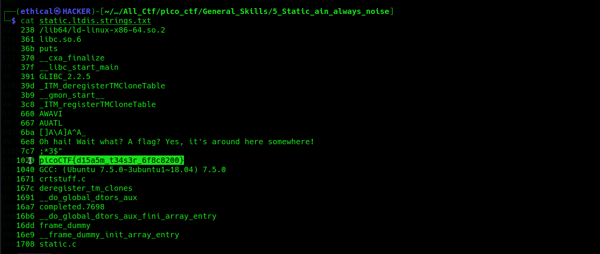
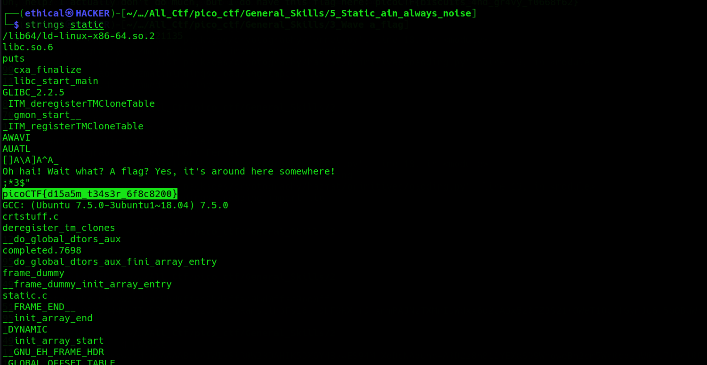

# Static ain't always noise
#### Points: 20

## Category
#### General Skills

## Question
#### Can you look at the data in this binary: [static](https://mercury.picoctf.net/static/0f6ea599582dcce7b4f1ba94e3617baf/static)? This [BASH script](https://mercury.picoctf.net/static/0f6ea599582dcce7b4f1ba94e3617baf/ltdis.sh) might help!

### Hint
>#### (None)

## Solution
### There are two types of solutions to this problem
>#### 1. Fast solution: download all the files and Writes this commendation `cat static.ltdis.strings.txt`

 

>#### 2. Secend Solution: Download all the files and Writes this Commendation `string static`

### Flag
#### `picoCTF{d15a5m_t34s3r_6f8c8200}`