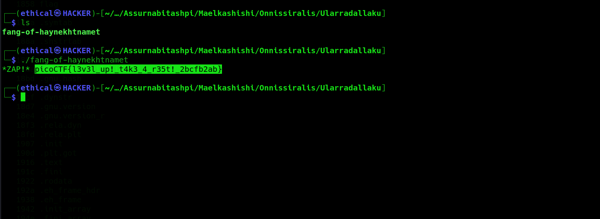

# Tab, Tab, Attack
#### Points: 20

## Category
#### General Skills

## Question
#### Using tabcomplete in the Terminal will add years to your life, esp. when dealing with long rambling directory structures and filenames: [Addadshashanammu.zip](https://mercury.picoctf.net/static/9689f2b453ad5daeb73ca7534e4d1521/Addadshashanammu.zip)

### Hint
#### After `unzip`ing, this problem can be solved with 11 button-presses...(mostly Tab)...

## Solution
The solution is very simple. Download the Addadshashanammu.zip file, and then unzip it. After unzipping, open multiple folders then type `./fang-of-haynekhtnamet`

### Flag
`picoCTF{l3v3l_up!_t4k3_4_r35t!_2bcfb2ab}`