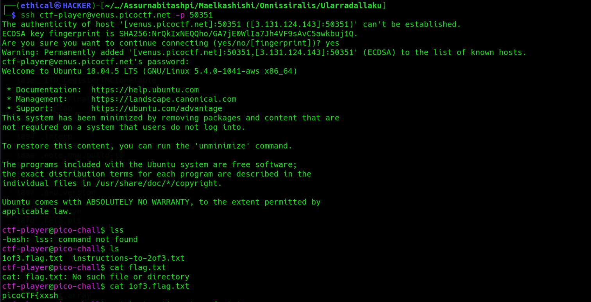
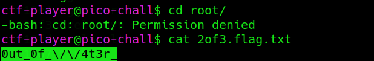
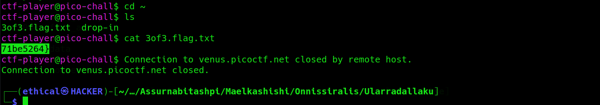

# Magikarp Ground Mission
Points: 30

## Category
General Skills

## Question
#### Do you know how to move between directories and read files in the shell? Start the container, `ssh` to it, and then `ls` once connected to begin. Login via `ssh` as `ctf-player` with the password, `a13b7f9d`

### Hint
>#### Finding a cheatsheet for bash would be really helpful!

## Solution
#### Here is a ctf ssh login ctf. . Fast click on the lounc button, then open the terminal and type `ssh ctf-player@venus.picoctf.net -p 51002` . After connecting, type `ls`, then `cat 10f3.flag.txt` to get the fast flag.

#### Second enter `cd root/` and type `ls`, then enter `cat 2of3.flag.txt` to get the secend flag.

#### Third enter `cd ~` and type `ls`, then enter `cat 3of3.flag.txt` to get third flag.

### Flag
`picoCTF{xxsh_0ut_0f_\/\/4t3r_71be5264}`