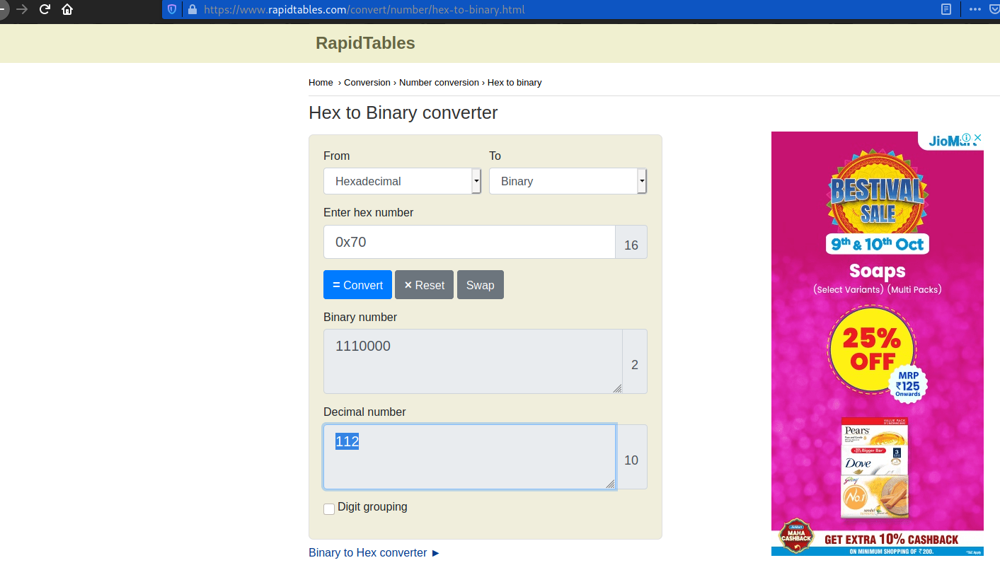

# Lets Warm Up
#### Points: 50

## Category
#### General Skills

## Question
#### If I told you a word started with 0x70 in hexadecimal, what would it start with in ASCII? 

### Hint
>#### Submit your answer in our flag format. For example, if your answer was 'hello', you would submit 'picoCTF{hello}' as the flag.

## Solution

#### Fast copy `0x70` then go to the [rapidtables](https://www.rapidtables.com/convert/number/hex-to-binary.html) site and paste the hex number .

#### Second copy decimal number and go to the [unit-conversion](http://www.unit-conversion.info/texttools/ascii/) site and paste the decimal number .

## Flag
`picoCTF{P}`