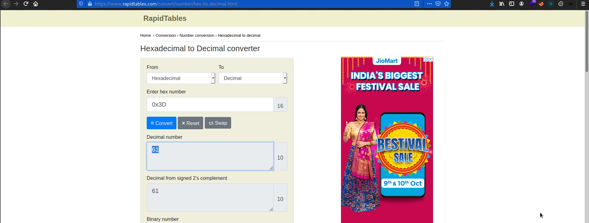

# Warmed Up
Points: 50

## Category
General Skills

## Question
#### What is 0x3D (base 16) in decimal (base 10)?

### Hint
>#### Submit your answer in our flag format. For example, if your answer was '22', you would submit 'picoCTF{22}' as the flag.
## Solution

#### Copy hex number `0x3D` and go to the [rapidtables](https://www.rapidtables.com/convert/number/hex-to-binary.html) site and paste the decimal number .

## Flag
`picoCTF{61}`