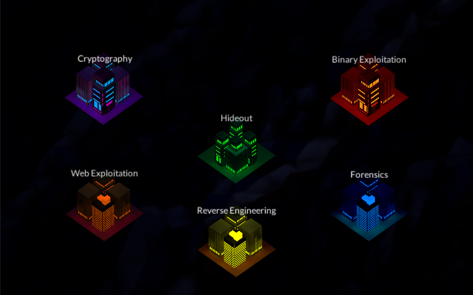

### PicoCTF 2021

## Overview

# Content Page
- [Binary Exploitation](#Binary_Exploitation)
- [Cryptography](#Cryptography)
- [Forensics](#Forensics)
- [General Skills](#General_Skills)
- [Reversing](#Reverse_Engineering)
- [Web Exploitation](#Web_Exploitation)

## Binary Exploitation
<table>
    <thead>
        <tr class="header">
            <th>Challenges</th>
            <th>Points</th>
            <th>Status</th>
            <th>Flag</th>
        </tr>
    </thead>
    <tbody>
        <tr>
            <td markdown="span"><a href="Binary Exploitation/1_Stonks">Stonks</a></td>
            <td markdown="span">20</td>
            <td markdown="span">Unsolved</td>
            <td markdown="span">Unsolved</td>
        </tr>
        <tr>
            <td markdown="span"><a href="Binary Exploitation/2_Cache_Me_Outside">Cache Me Outside</a></td>
            <td markdown="span">70</td>
            <td markdown="span">Unsolved</td>
            <td markdown="span">Unsolved</td>
        </tr>
        <tr>
            <td markdown="span"><a href="Binary Exploitation/3_Here's a_LIBC">Here's a LIBC</a></td>
            <td markdown="span">200</td>
            <td markdown="span">Unsolved</td>
            <td markdown="span">Unsolved</td>
        </tr>
        <tr>
            <td markdown="span"><a href="Binary Exploitation/4_Unsubscriptions_Are_Free">Unsubscriptions Are Free</a></td>
            <td markdown="span">100</td>
            <td markdown="span">Unsolved</td>
            <td markdown="span">Unsolved</td>
        </tr>
        <tr>
            <td markdown="span"><a href="Binary Exploitation/5_clutter_overflow">Clutter-Overflow</a></td>
            <td markdown="span">150</td>
            <td markdown="span">Unsolved</td>
            <td markdown="span">Unsolved</td>
        </tr>
        <tr>
            <td markdown="span"><a href="Binary Exploitation/6_filtered_shellcode">Filtered-Shellcode</a></td>
            <td markdown="span">160</td>
            <td markdown="span">Unsolved</td>
            <td markdown="span">Unsolved</td>
        </tr>
        <tr>
            <td markdown="span"><a href="Binary Exploitation/7_Kit_Engine">Kit Engine</a></td>
            <td markdown="span">250</td>
            <td markdown="span">Unsolved</td>
            <td markdown="span">Unsolved</td>
        </tr>
        <tr>
            <td markdown="span"><a href="Binary Exploitation/8_Guessing_Game_1">Stonk Market</a></td>
            <td markdown="span">250</td>
            <td markdown="span">Unsolved</td>
            <td markdown="span">Unsolved</td>
        </tr>
        <tr>
            <td markdown="span"><a href="Binary Exploitation/9_Stonk_Market">Fermat-Strings</a></td>
            <td markdown="span">350</td>
            <td markdown="span">Unsolved</td>
            <td markdown="span">Unsolved</td>
        </tr>
        <tr>
            <td markdown="span"><a href="Binary Exploitation/10_fermat_strings">Rop Chain</a></td>
            <td markdown="span">250</td>
            <td markdown="span">Unsolved</td>
            <td markdown="span">Unsolved</td>
        </tr>
        <tr>
            <td markdown="span"><a href="Binary Exploitation/11_MESSY_MALLOC">Messy-Malloc</a></td>
            <td markdown="span">300</td>
            <td markdown="span">Unsolved</td>
            <td markdown="span">Unsolved</td>
        </tr>
        <tr>
            <td markdown="span"><a href="Binary Exploitation/12_Guessing_Game_2">Guessing Game 2</a></td>
            <td markdown="span">300</td>
            <td markdown="span">Unsolved</td>
            <td markdown="span">Unsolved</td>
        </tr>
        <tr>
            <td markdown="span"><a href="Binary Exploitation/13_seed_sPRiNG">seed-sPRiNG</a></td>
            <td markdown="span">350</td>
            <td markdown="span">Unsolved</td>
            <td markdown="span">Unsolved</td>
        </tr>
        <tr>
            <td markdown="span"><a href="Binary Exploitation/14_Download_Horsepower">Download Horsepower</a></td>
            <td markdown="span">350</td>
            <td markdown="span">Unsolved</td>
            <td markdown="span">Unsolved</td>
        </tr>
        <tr>
            <td markdown="span"><a href="Binary Exploitation/15_SaaS">SaaS</a></td>
            <td markdown="span">350</td>
            <td markdown="span">Unsolved</td>
            <td markdown="span">Unsolved</td>
        </tr>
        <tr>
            <td markdown="span"><a href="Binary Exploitation/16_The_Office">The Office</a></td>
            <td markdown="span">400</td>
            <td markdown="span">Unsolved</td>
            <td markdown="span">Unsolved</td>
        </tr>
        <tr>
            <td markdown="span"><a href="Binary Exploitation/17_homework">Homework</a></td>
            <td markdown="span">400</td>
            <td markdown="span">Unsolved</td>
            <td markdown="span">Unsolved</td>
        </tr>
        <tr>
            <td markdown="span"><a href="Binary Exploitation/18_Turboflan">Turboflan</a></td>
            <td markdown="span">450</td>
            <td markdown="span">Unsolved</td>
            <td markdown="span">Unsolved</td>
        </tr>
        <tr>
            <td markdown="span"><a href="Binary Exploitation/19_lockdown_horses">Lockdown-Horses</a></td>
            <td markdown="span">450</td>
            <td markdown="span">Unsolved</td>
            <td markdown="span">Unsolved</td>
        </tr>
        <tr>
            <td markdown="span"><a href="Binary Exploitation/20_sice_cream">Sice_Cream</a></td>
            <td markdown="span">500</td>
            <td markdown="span">Unsolved</td>
            <td markdown="span">Unsolved</td>
        </tr>
        <tr>
            <td markdown="span"><a href="Binary Exploitation/21_zero_to_hero">Zero_To_Hero</a></td>
            <td markdown="span">500</td>
            <td markdown="span">Unsolved</td>
            <td markdown="span">Unsolved</td>
        </tr>
        <tr>
            <td markdown="span"><a href="Binary Exploitation/22_Bizz_Fuzz">Bizz Fuzz</a></td>
            <td markdown="span">500</td>
            <td markdown="span">Unsolved</td>
            <td markdown="span">Unsolved</td>
        </tr>
        <tr>
            <td markdown="span"><a href="Binary Exploitation/23_vr-school">Vr-School</a></td>
            <td markdown="span">500</td>
            <td markdown="span">Unsolved</td>
            <td markdown="span">Unsolved</td>
        </tr>
    </tbody>
</table>

## Cryptography
<table>
    <thead>
        <tr class="header">
            <th>Challenges</th>
            <th>Points</th>
            <th>Status</th>
            <th>Flag</th>
        </tr>
    </thead>
    <tbody>
        <tr>
            <td markdown="span"><a href="Cryptography/1_Mod_26">Mod 26</a></td>
            <td markdown="span">10</td>
            <td markdown="span">Solved</td>
            <td markdown="span">picoCTF{next_time_I'll_try_2_rounds_of_rot13_ulYvpVag}</td>
        </tr>
        <tr>
            <td markdown="span"><a href="Cryptography/2_Mind_your_Ps_and_Qs">Mind your Ps and Qs</a></td>
            <td markdown="span">20</td>
            <td markdown="span">Unsolved</td>
             <td markdown="span">Unsolved</td>
        </tr>
        <tr>
            <td markdown="span"><a href="Cryptography/3_Easy_Peasy">Easy Peasy</a></td>
            <td markdown="span">40</td>
            <td markdown="span">Unsolved</td>
            <td markdown="span">Unsolved</td>
        </tr>
        <tr>
            <td markdown="span"><a href="Cryptography/4_The_Numbers">The Numbers</a></td>
            <td markdown="span">50</td>
            <td markdown="span">Solved</td>
            <td markdown="span">PICOCTF{THENUMBERSMASON}</td>
        </tr>
        <tr>
            <td markdown="span"><a href="Cryptography/5_New_Caesar">New Caesar</a></td>
            <td markdown="span">60</td>
            <td markdown="span">Solved</td>
            <td markdown="span">picoCTF{et_tu?_07d5c0892c1438d2b32600e83dc2b0e5}</td>
        </tr>
        <tr>
            <td markdown="span"><a href="Cryptography/6_Mini_RSA">Mini RSA</a></td>
            <td markdown="span">70</td>
            <td markdown="span">Solved</td>
            <td markdown="span">picoCTF{e_sh0u1d_b3_lArg3r_0b39bbb1}</td>
        </tr>
        <tr>
            <td markdown="span"><a href="Cryptography/7_Dachshund_Attacks">Dachshund Attacks</a></td>
            <td markdown="span">80</td>
            <td markdown="span">Solved</td>
            <td markdown="span">picoCTF{proving_wiener_8652838}</td>
        </tr>
        <tr>
            <td markdown="span"><a href="Cryptography/8_No_Padding_No_Problem">No Padding, No Problem</a></td>
            <td markdown="span">90</td>
            <td markdown="span">Solved</td>
            <td markdown="span">picoCTF{m4yb3_Th0se_m3s54g3s_4r3_difurrent_3279013}</td>
        </tr>
        <tr>
            <td markdown="span"><a href="Cryptography/9_Easy1">Easy1</a></td>
            <td markdown="span">100</td>
            <td markdown="span">Solved</td>
            <td markdown="span">picoCTF{CRYPTOISFUN}</td>
        </tr>
        <tr>
            <td markdown="span"><a href="Cryptography/10_13">13</a></td>
            <td markdown="span">100</td>
            <td markdown="span">Solved</td>
            <td markdown="span">picoCTF{not_too_bad_of_a_problem}</td>
        </tr>
        <tr>
            <td markdown="span"><a href="Cryptography/11_caesar">Caesar</a></td>
            <td markdown="span">100</td>
            <td markdown="span">Solved</td>
            <td markdown="span">picoCTF{crossingtherubicondjneoach}</td>
        </tr>
        <tr>
            <td markdown="span"><a href="Cryptography/12_Pixelated">Pixelated</a></td>
            <td markdown="span">100</td>
            <td markdown="span">Solved</td>
            <td markdown="span">picoCTF{d72ea4af}</td>
        </tr>
        <tr>
            <td markdown="span"><a href="Cryptography/13_spelling-quiz">Spelling-Quiz</a></td>
            <td markdown="span">100</td>
            <td markdown="span">Solved</td>
            <td markdown="span">picoCTF{perhaps_the_dog_jumped_over_was_just_tired}</td>
        </tr>
        <tr>
            <td markdown="span"><a href="Cryptography/14_Play_Nice">Play Nice</a></td>
            <td markdown="span">110</td>
            <td markdown="span">Unsolved</td>
            <td markdown="span">Unsolved</td>
        </tr>
        <tr>
            <td markdown="span"><a href="Cryptography/15_Double_DES">Double DES</a></td>
            <td markdown="span">130</td>
            <td markdown="span">Unsolved</td>
            <td markdown="span">Unsolved</td>
        </tr>
        <tr>
            <td markdown="span"><a href="Cryptography/16_Compress_and_Attack">Compress and Attack</a></td>
            <td markdown="span">140</td>
            <td markdown="span">Unsolved</td>
            <td markdown="span">Unsolved</td>
        </tr>
        <tr>
            <td markdown="span"><a href="Cryptography/17_Scrambled_RSA">Scrambled: RSA</a></td>
            <td markdown="span">140</td>
            <td markdown="span">Unsolved</td>
            <td markdown="span">Unsolved</td>
        </tr>
        <tr>
            <td markdown="span"><a href="Cryptography/18_XtraORdinary">XtraORdinary</a></td>
            <td markdown="span">150</td>
            <td markdown="span">Unsolved</td>
            <td markdown="span">Unsolved</td>
        </tr>
        <tr>
            <td markdown="span"><a href="Cryptography/19_triple_secure">triple-secure</a></td>
            <td markdown="span">150</td>
            <td markdown="span">Unsolved</td>
            <td markdown="span">Unsolved</td>
        </tr>
        <tr>
            <td markdown="span"><a href="Cryptography/20_la_cifra_de">La Cifra De</a></td>
            <td markdown="span">200</td>
            <td markdown="span">Solved</td>
            <td markdown="span">picoCTF{b311a50_Or_v1gn3r3_c1ph3r6fe60eaa}</td>
        </tr>
        <tr>
            <td markdown="span"><a href="Cryptography/21_Tapping">Tapping</a></td>
            <td markdown="span">200</td>
            <td markdown="span">Solved</td>
            <td markdown="span">picoCTF{MORS3C0D31SFUN1261438181}</td>
        </tr>
        <tr>
            <td markdown="span"><a href="Cryptography/22_Flags">Flags</a></td>
            <td markdown="span">200</td>
            <td markdown="span">Solved</td>
            <td markdown="span">picoCTF{F1AG5AND5TUFF}</td>
        </tr>
        <tr>
            <td markdown="span"><a href="Cryptography/23_Mr_Worldwide">Mr-Worldwide</a></td>
            <td markdown="span">200</td>
            <td markdown="span">Solved</td>
            <td markdown="span">picoCTF{KODIAK_ALASKA}</td>
        </tr>
        <tr>
            <td markdown="span"><a href="Cryptography/24_rsa_pop_quiz">rsa-pop-quiz</a></td>
            <td markdown="span">200</td>
            <td markdown="span">Unsolved</td>
            <td markdown="span">Unsolved</td>
        </tr>
        <tr>
            <td markdown="span"><a href="Cryptography/25_college_rowing_team">College-Rowing-Team</a></td>
            <td markdown="span">250</td>
            <td markdown="span">Solved</td>
            <td markdown="span">picoCTF{1_gu3ss_p30pl3_p4d_m3ss4g3s_f0r_4_r34s0n}</td>
        </tr>
         <tr>
            <td markdown="span"><a href="Cryptography/26_waves_over_lambda">Waves Over Lambda</a></td>
            <td markdown="span">300</td>
            <td markdown="span">Solved</td>
            <td markdown="span">picoCTF{frequency_is_c_over_lambda_agflcgtyue}</td>
        </tr>
         <tr>
            <td markdown="span"><a href="Cryptography/27_miniRSA">miniRSA</a></td>
            <td markdown="span">300</td>
            <td markdown="span">Solved</td>
            <td markdown="span">picoCTF{n33d_a_lArg3r_e_d0cd6eae}</td>
        </tr>
         <tr>
            <td markdown="span"><a href="Cryptography/28_It's_Not_My_Fault_1">It's Not My Fault 1</a></td>
            <td markdown="span">300</td>
            <td markdown="span">Unsolved</td>
            <td markdown="span">Unsolved</td>
        </tr>
        <tr>
            <td markdown="span"><a href="Cryptography/29_New_Vignere">New Vignere</a></td>
            <td markdown="span">300</td>
            <td markdown="span">Unsolved</td>
            <td markdown="span">Unsolved</td>
        </tr>
        <tr>
            <td markdown="span"><a href="Cryptography/30_corrupt_key_1">corrupt-key-1</a></td>
            <td markdown="span">350</td>
            <td markdown="span">Unsolved</td>
            <td markdown="span">Unsolved</td>
        </tr>
        <tr>
            <td markdown="span"><a href="Cryptography/31_b00tl3gRSA2">b00tl3gRSA2</a></td>
            <td markdown="span">400</td>
            <td markdown="span">Solved</td>
            <td markdown="span">picoCTF{bad_1d3a5_2152720}</td>
        </tr>
        <tr>
            <td markdown="span"><a href="Cryptography/32_AES_ABC">AES-ABC</a></td>
            <td markdown="span">300</td>
            <td markdown="span">Solved</td>
            <td markdown="span">picoCTF{d0nt_r0ll_yoUr_0wN_aES}</td>
        </tr>
        <tr>
            <td markdown="span"><a href="Cryptography/33_b00tl3gRSA3">b00tl3gRSA3</a></td>
            <td markdown="span">450</td>
            <td markdown="span">Unsolved</td>
            <td markdown="span">Unsolved</td>
        </tr>
        <tr>
            <td markdown="span"><a href="Cryptography/34_john_pollard">John_Pollard</a></td>
            <td markdown="span">500</td>
            <td markdown="span">Unsolved</td>
            <td markdown="span">Unsolved</td>
        </tr>
        <tr>
            <td markdown="span"><a href="Cryptography/35_Clouds">Clouds</a></td>
            <td markdown="span">500</td>
            <td markdown="span">Unsolved</td>
            <td markdown="span">Unsolved</td>
        </tr>
        <tr>
            <td markdown="span"><a href="Cryptography/36_corrupt_key_2">Corrupt-Key-2</a></td>
            <td markdown="span">500</td>
            <td markdown="span">Unsolved</td>
            <td markdown="span">Unsolved</td>
        </tr>
    </tbody>
</table>

## Forensics
<table>
    <thead>
        <tr class="header">
            <th>Challenges</th>
            <th>Points</th>
            <th>Status</th>
        </tr>
    </thead>
    
</table>

## General Skills
<table>
    <thead>
        <tr class="header">
            <th>Challenges</th>
            <th>Points</th>
            <th>Status</th>
        </tr>
    </thead>
    
</table>

## Reversing
<table>
    <thead>
        <tr class="header">
            <th>Challenges</th>
            <th>Points</th>
            <th>Status</th>
        </tr>
    </thead>
    
       
</table>

## Web Exploitation
<table>
    <thead>
        <tr class="header">
            <th>Challenges</th>
            <th>Points</th>
            <th>Status</th>
        </tr>
    </thead>
    
     
</table>
