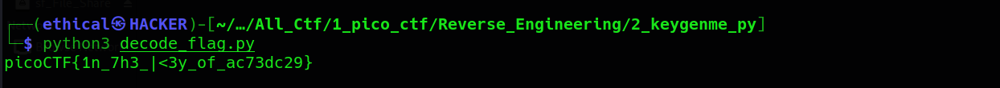

# Keygenme-py
### Points: 

## Category
#### Reverse Engineering

## Question
#### [keygenme-trial.py](https://mercury.picoctf.net/static/9055e7d35f5f4646338a1734aea0dda5/keygenme-trial.py "keygenme-trial")
### Hint
>#### (None)


## Solution
### Looking at the top of the python file we see:

```python
username_trial = "PRITCHARD"
bUsername_trial = b"PRITCHARD"

key_part_static1_trial = "picoCTF{1n_7h3_|<3y_of_"
key_part_dynamic1_trial = "xxxxxxxx"
key_part_static2_trial = "}"
```

#### Looking through the file a bit more we trace the path from accepting the key till a function that seems to try to decrypt the key:

```python
def check_key(key, username_trial):

    global key_full_template_trial

    if len(key) != len(key_full_template_trial):
        return False
    else:
        # Check static base key part --v
        i = 0
        for c in key_part_static1_trial:
            if key[i] != c:
                return False

            i += 1

        # TODO : test performance on toolbox container
        # Check dynamic part --v
        if key[i] != hashlib.sha256(username_trial).hexdigest()[4]:
            return False
        else:
            i += 1

        if key[i] != hashlib.sha256(username_trial).hexdigest()[5]:
            return False
        else:
            i += 1

        if key[i] != hashlib.sha256(username_trial).hexdigest()[3]:
            return False
        else:
            i += 1

        if key[i] != hashlib.sha256(username_trial).hexdigest()[6]:
            return False
        else:
            i += 1

        if key[i] != hashlib.sha256(username_trial).hexdigest()[2]:
            return False
        else:
            i += 1

        if key[i] != hashlib.sha256(username_trial).hexdigest()[7]:
            return False
        else:
            i += 1

        if key[i] != hashlib.sha256(username_trial).hexdigest()[1]:
            return False
        else:
            i += 1

        if key[i] != hashlib.sha256(username_trial).hexdigest()[8]:
            return False


        return True
```

#### From here I wrote a little script to decrypt the missing characters from the flag:
```python

import hashlib
import base64


hash = hashlib.sha256(b'FRASER').hexdigest()
list = [4,5,3,6,2,7,1,8]


print("picoCTF{1n_7h3_|<3y_of_",end ='')

for i in list:
	print(hash[i], end = '')
print("}")	

```




## Flag
`picoCTF{1n_7h3_|<3y_of_ac73dc29}`