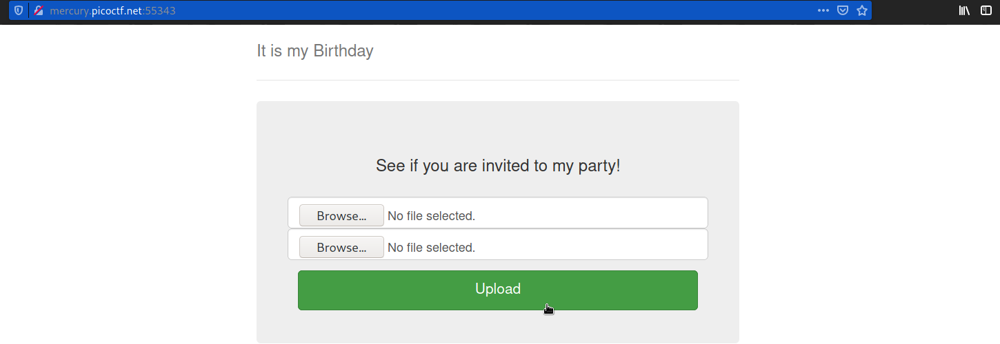
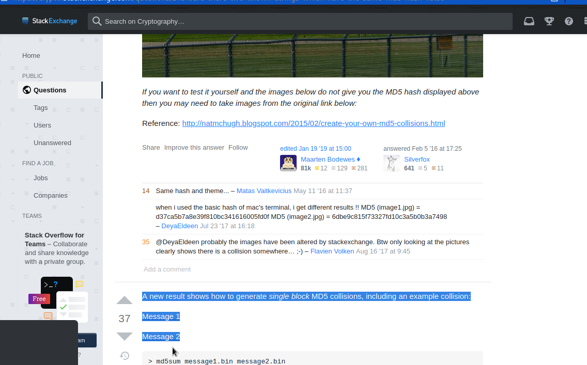
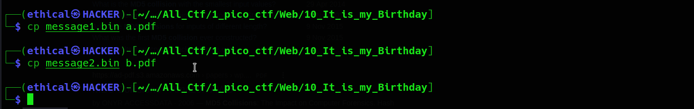
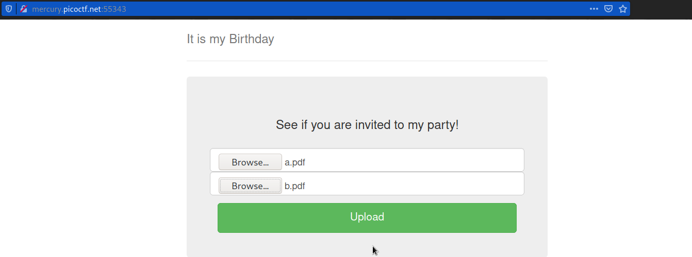
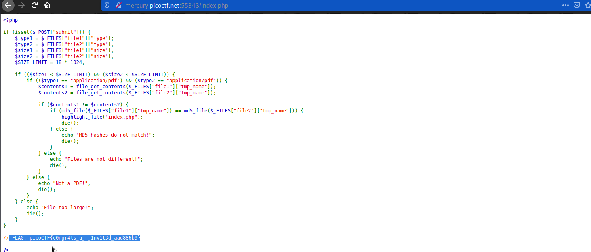

# It is my Birthday
### Points: 100

## Category
#### Web Exploitation

## Question
#### I sent out 2 invitations to all of my friends for my birthday! I'll know if they get stolen because the two invites look similar, and they even have the same md5 hash, but they are slightly different! You wouldn't believe how long it took me to find a collision. Anyway, see if you're invited by submitting 2 PDFs to my website. http://mercury.picoctf.net:55343/
### Hint
>#### 1. Look at the category of this problem.
>#### 2. How may a PHP site check the rules in the description?

## Solution
### Look at this website

#### Essentially, it wants you to upload two separate PDF files with the same MD5 Hash. You can find other files with the same MD5 hash by searching for them on the internet. All you have to do is change the file extension to pdf to upload them. The MD5 hash will not be affected, however it will be validated as a PDF because their PHP only checks file extensions.
#### Download md5 hash 1 and 2 file this [stackexchange](https://crypto.stackexchange.com/questions/1434/are-there-two-known-strings-which-have-the-same-md5-hash-value) website .

#### Next open tha kali linux terminal then first type `cp message1.bin a.pdf` and second type `cp message2.bin b.pdf` .

#### Then go to the website and upload the pdf files a and b . 

#### After that click Upload to obtain the flag .

## Flag
`picoCTF{c0ngr4ts_u_r_1nv1t3d_aad886b9}`