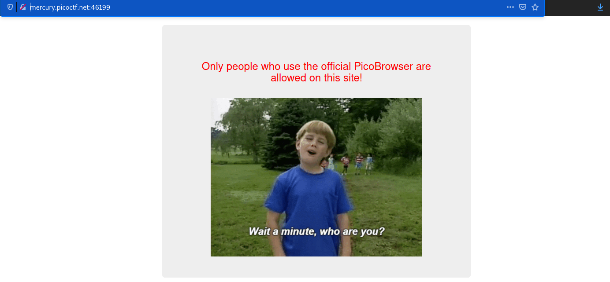
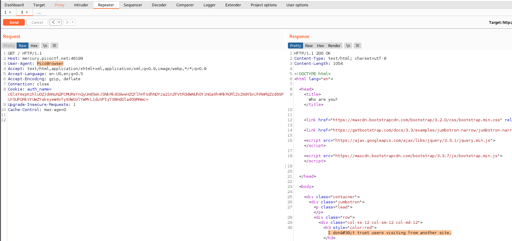
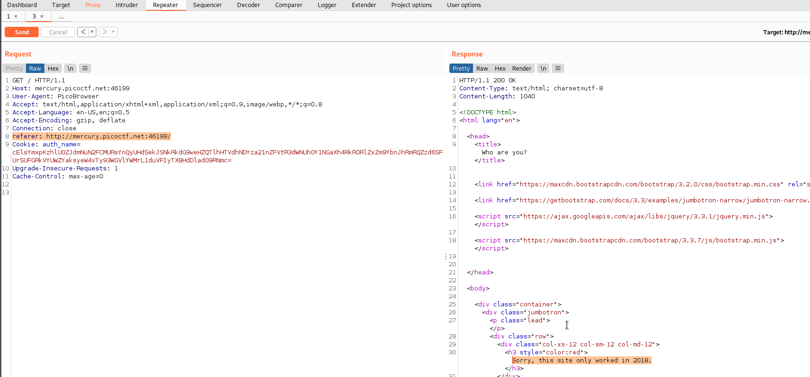
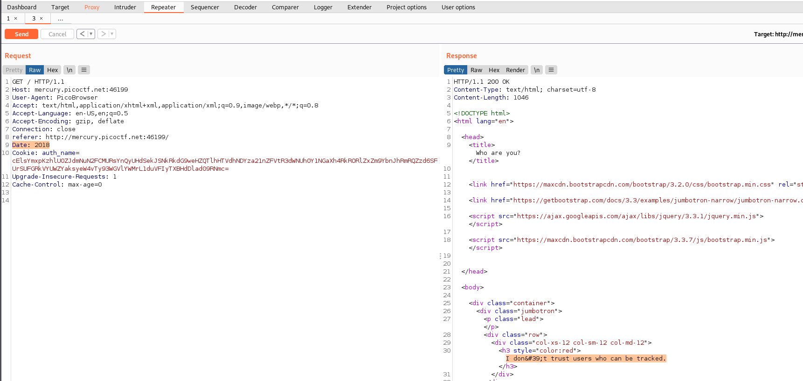
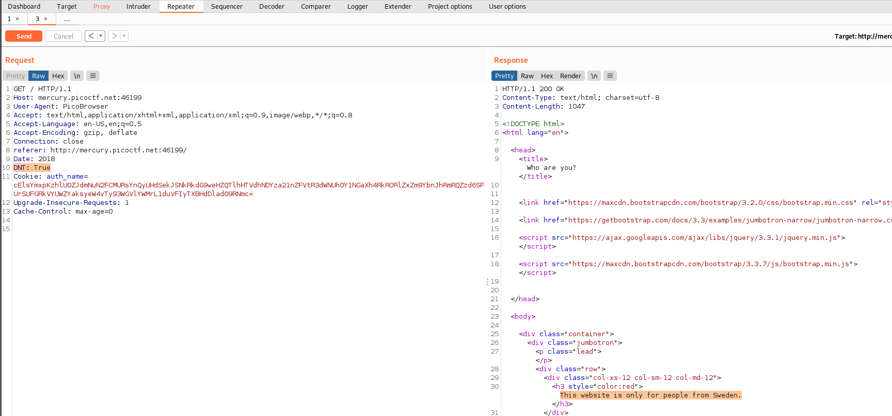
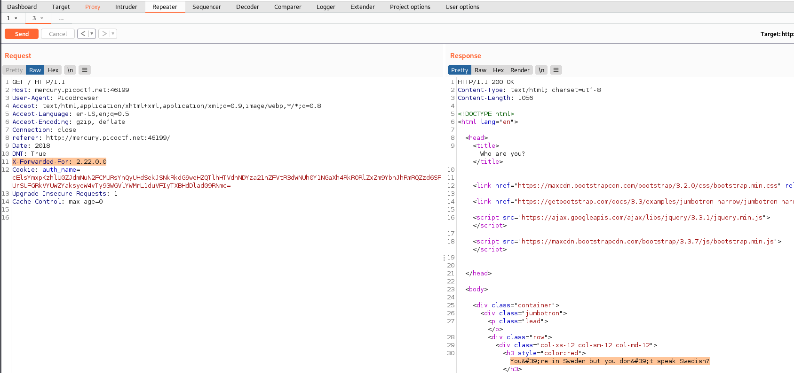
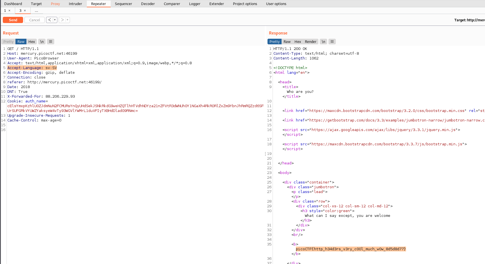

# Who are you?
### Points: 

## Category
#### Web Exploitation

## Question
#### Let me in. Let me iiiiiiinnnnnnnnnnnnnnnnnnnn http://mercury.picoctf.net:46199/
### Hint
>#### It ain't much, but it's an RFC https://tools.ietf.org/html/rfc2616
 

## Solution
### Look at this website

#### First, Open the webpage, then use Burp Suite to intercept and change the user-agent:`PicoBrowser`, send and see response .

#### Second, include `Referer: http://mercury.picoctf.net:46199/` then send and see response .

#### Third, include `Date: 2018` then send and see response .

#### 4th include `DNT: True` then send and see response .

#### Fiveth, include `X-Forwarded-For: 2.22.0.0` then send and see response .

#### Last include `Accept-Language: sv-SV` then send get the flag .

## Flag
`picoCTF{http_h34d3rs_v3ry_c0Ol_much_w0w_8d5d8d77}`