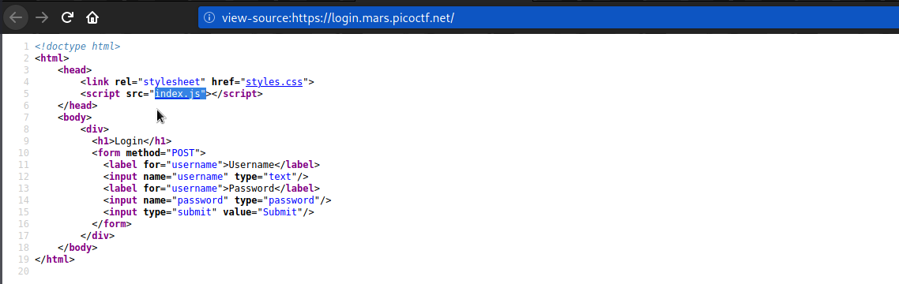
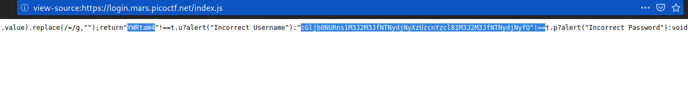
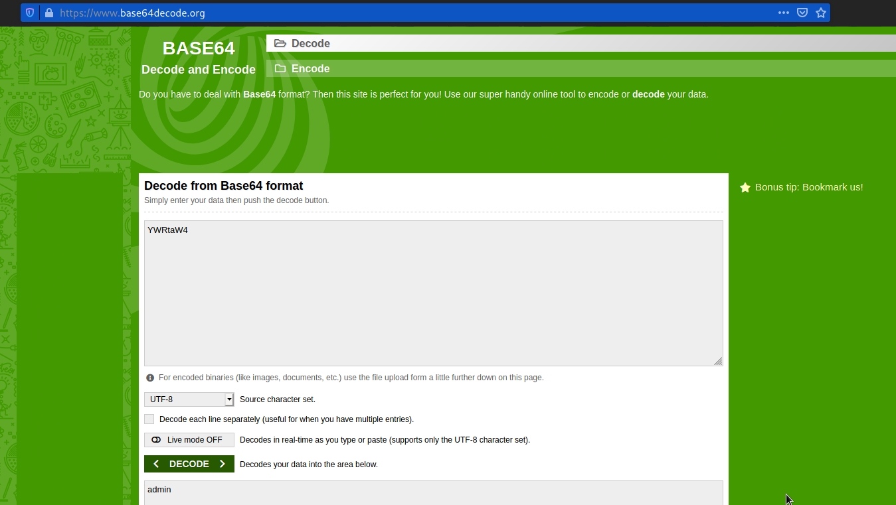
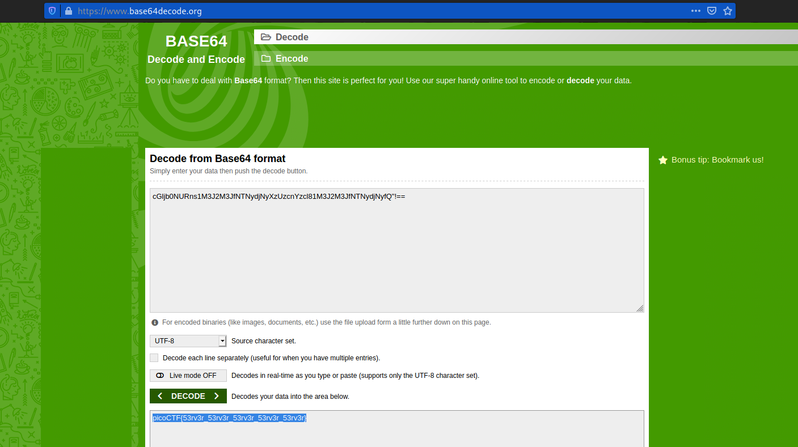

# Login
### Points: 100

## Category
#### Web Exploitation

## Question
#### My dog-sitter's brother made this website but I can't get in; can you help?
#### [login.mars.picoctf.net](https://login.mars.picoctf.net/)
### Hint
>#### (None)

## Solution
### Look at this website

#### Write click then click view page source, go to `index.js` .

#### After that, Read the savascript code. obtain the base64 encoding of the user name and password .

#### Decode first encoding .

#### Decode second encoding, Get the flag .

## Flag
`picoCTF{53rv3r_53rv3r_53rv3r_53rv3r_53rv3r}`