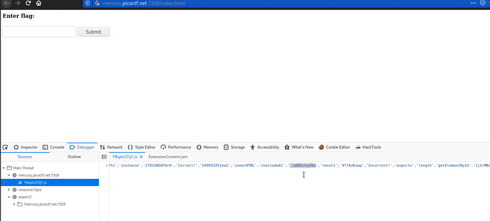

# Some Assembly Required 2
### Points: 110

## Category
#### Web Exploitation

## Question
#### http://mercury.picoctf.net:7319/index.html
### Hint
>#### (None)

## Solution
### Look at this website

#### First write click and inspect element, then go to debugger and read js file, after that I got a path .

#### Then, copy the path and paste the url, and finally, download the file. 

#### Next, execute this `strings <file name>` comment in kali linux terminal .then copy encode text.

#### Then, go to this [CyberChef](https://gchq.github.io/CyberChef/#recipe=Magic(3,true,false,'pico')&input=eGFrZ0tcNWNOczk9ODo5bDE/aW04aTw4OT8wMD44OGswOT1uajlraW1udQ) website and decode this code to obtain the flag. 

## Flag
`picoCT=kF{15021d97ae0a401788600c815fb1caef}`