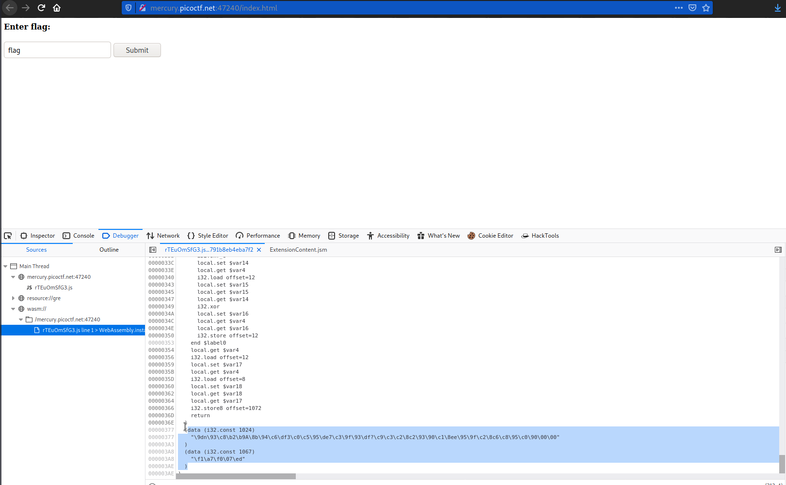

# Some Assembly Required 3
### Points: 160

## Category
#### Web Exploitation

## Question
#### http://mercury.picoctf.net:47240/index.html
### Hint
>#### (None)


## Solution
### Look at this website


#### First, go to the web page and write click, then inspact element, then debugger, wasm, and read all content 

#### Second, copy and save the `decode.py` file with all of the python code. 
```python
d_1024 = b"\x9dn\x93\xc8\xb2\xb9A\x8b\x94\xc6\xdf3\xc0\xc5\x95\xde7\xc3\x9f\x93\xdf?\xc9\xc3\xc2\x8c2\x93\x90\xc1\x8ee\x95\x9f\xc2\x8c6\xc8\x95\xc0\x90\x00\x00"
d_1067 = b"\xf1\xa7\xf0\x07\xed"

out = bytearray()
for i, c in enumerate(d_1024):
	char = d_1067[4 - (i % 5)]
	out.append(c ^ char)
print(out)	
```

#### Finally, open a kali linux terminal and run the command 'python3 decode.py' to obtain the falg. 


## Flag
`picoCTF{37240bd3038b289d3a5c70cbe83a1821}`