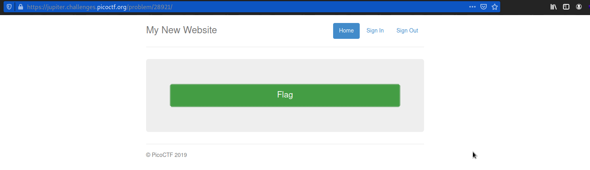
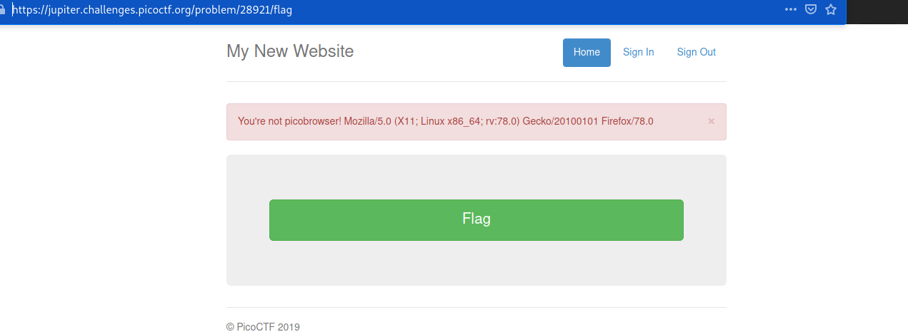
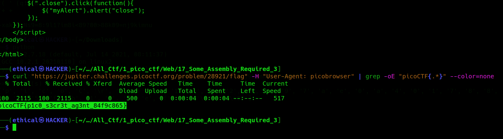

# Picobrowser
### Points: 200

## Category
#### Web Exploitation

## Question
#### This website can be rendered only by picobrowser, go and catch the flag! https://jupiter.challenges.picoctf.org/problem/28921/ [link](https://jupiter.challenges.picoctf.org/problem/28921/) or http://jupiter.challenges.picoctf.org:28921
### Hint
>#### You don't need to download a new web browser

## Solution
### Look at this website

#### [This website](https://2019shell1.picoctf.com/problem/32205/) has a button you can press that will give you the flag. However, if you press it in your web browser, it will give you an error saying "You're not picobrowser!" and list some text after it that depends on your OS and browser (for me, it says Mozilla/5.0 (X11; Ubuntu; Linux x86_64; rv:70.0) Gecko/20100101 Firefox/70.0, but yours will likel be different).

#### That string of text is known as a [User-Agent](https://en.wikipedia.org/wiki/User_agent) and it tells the server what browser you're using.

#### To convince them that you're running pico browser, you can just change your user-agent string. To do this, I chose to use curl because it easily allows you to control the headers. You need to run

#### Start Kali Linux and use the ` curl "https://jupiter.challenges.picoctf.org/problem/28921/flag" -H "User-Agent: picobrowser" | grep -oE "picoCTF{.*}" --color=none ` command. then get tha flag.

## Flag
`picoCTF{p1c0_s3cr3t_ag3nt_84f9c865}`