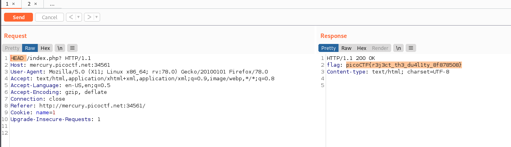

# GET aHEAD
### Points: 20

## Category
#### Web Exploitation

## Question
#### Find the flag being held on this server to get ahead of the competition http://mercury.picoctf.net:34561/
### Hint
>####  1. Maybe you have more than 2 choices
>####  2. Check out tools like Burpsuite to modify your requests and look at the responses

## Solution

#### Launch the burpsuite and Intercept your request, then modify it by changing the get request to the head request and get the flag . 

## Flag
`picoCTF{r3j3ct_th3_du4l1ty_8f878508}`