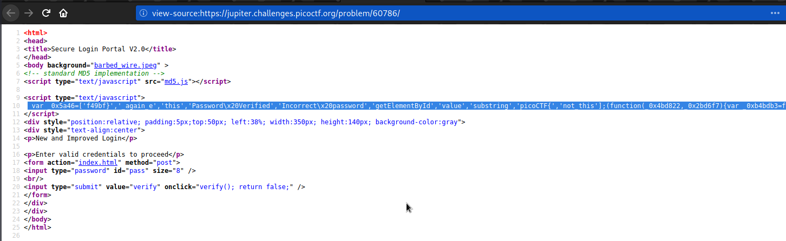

# Client-side-again
### Points: 200

## Category
#### Web Exploitation

## Question
#### Can you break into this super secure portal? https://jupiter.challenges.picoctf.org/problem/60786/ (link) or http://jupiter.challenges.picoctf.org:60786
### Hint
>#### What is obfuscation?

## Solution
### Look at this website

#### First write click and inspect page source, then copy all java script code. 

#### Second visit this [jsnice](http://www.jsnice.org/) webpage and paste. After completing the form, read the java script code. 

#### Third Get the flag by copying the password-verified java script code and the formatting code. .

## Flag
`picoCTF{not_this_again_ef49bf}`