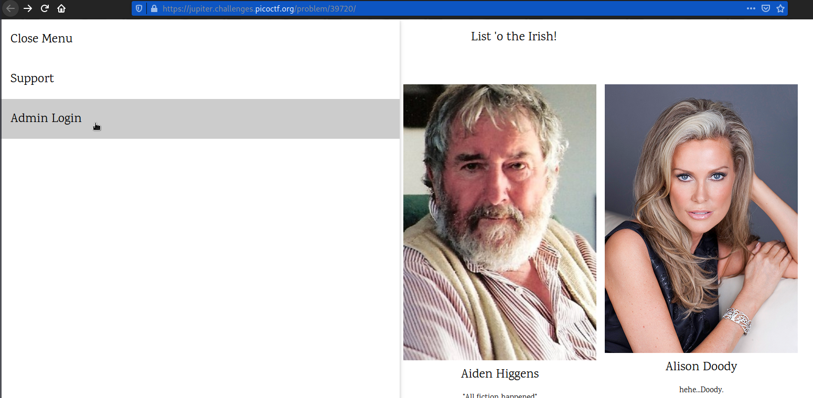
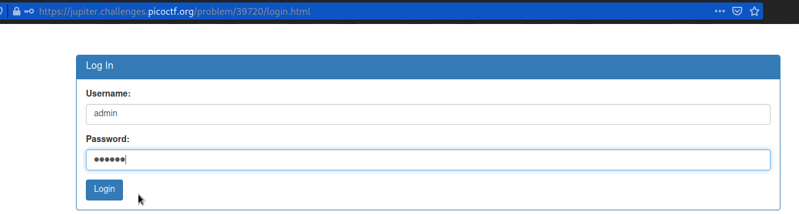
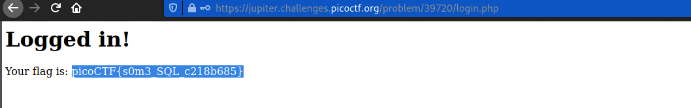

# Irish-Name-Repo 1
### Points: 300

## Category
#### Web Exploitation

## Question
#### There is a website running at https://jupiter.challenges.picoctf.org/problem/39720/ [link](https://jupiter.challenges.picoctf.org/problem/39720/) or http://jupiter.challenges.picoctf.org:39720. Do you think you can log us in? Try to see if you can login!
### Hint
>#### 1. There doesn't seem to be many ways to interact with this. I wonder if the users are kept in a database?
>#### 2. Try to think about how the website verifies your login.

## Solution
### Look at this website

#### Go to the login page for administrators. 

#### Bypass filter: 
```base
Username = admin
Password = 'OR '1'='1
```

#### After logging, and retrieve the flag. 


## Flag
`picoCTF{s0m3_SQL_c218b685}`