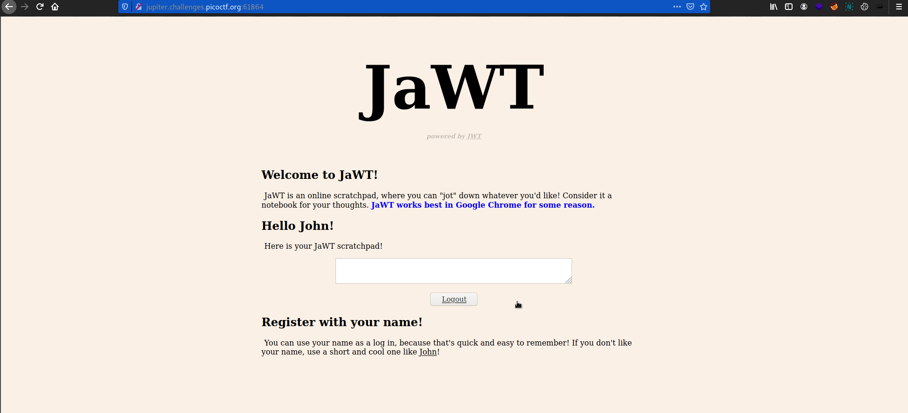
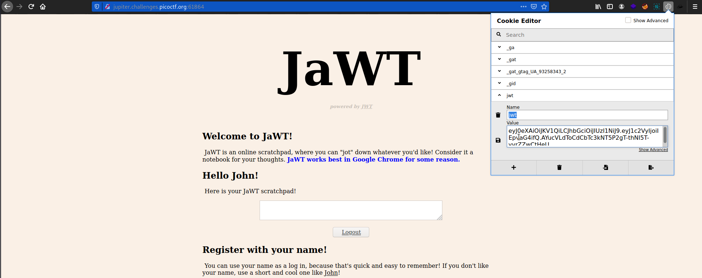
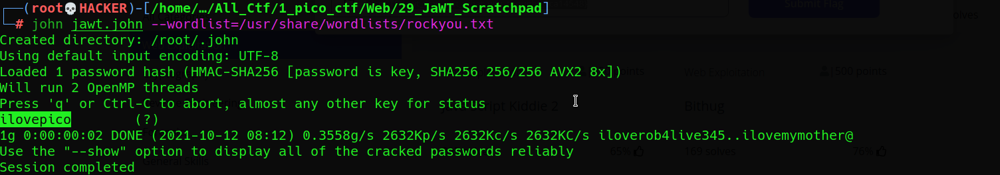
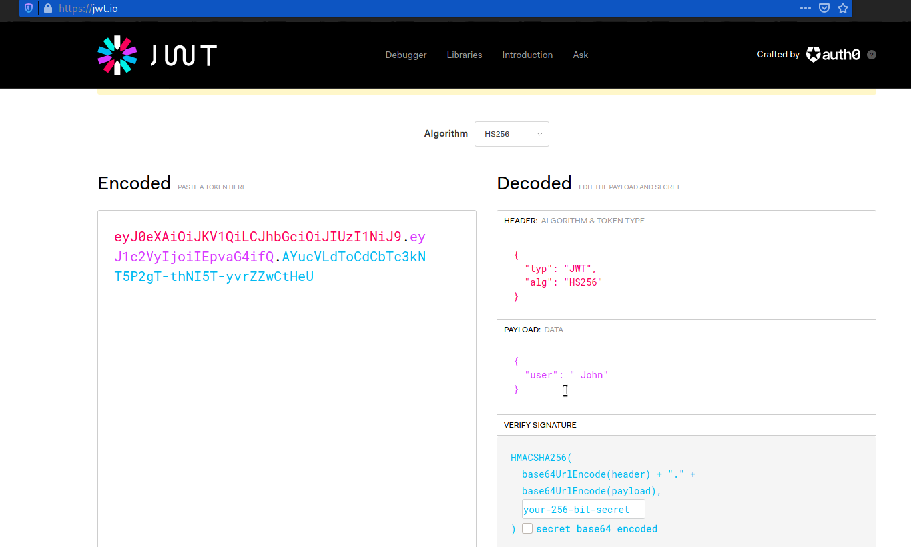
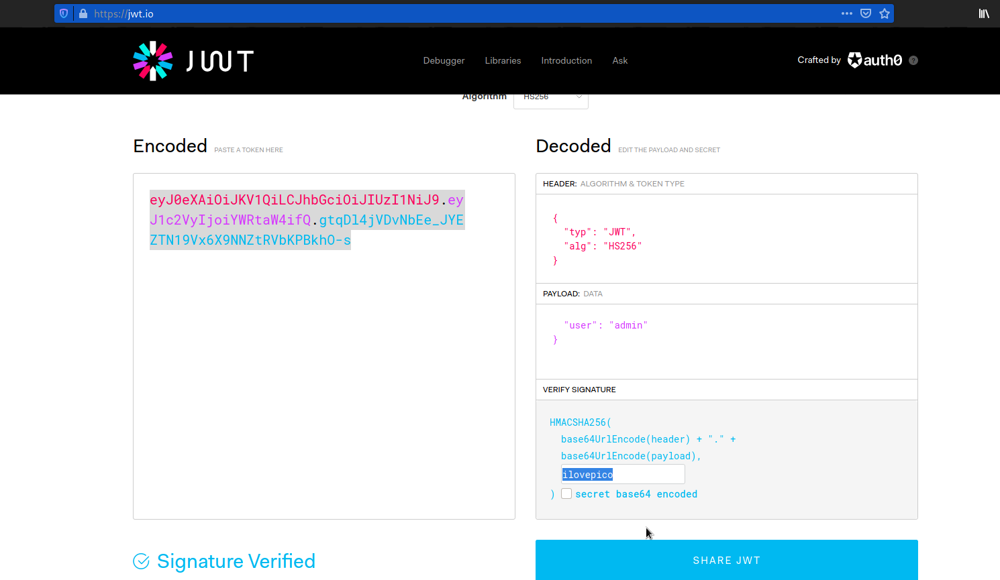
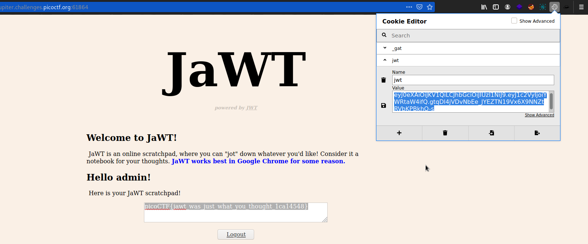

# JaWT Scratchpad
### Points: 400

## Category
#### Web Exploitation

## Question
#### Check the admin scratchpad! https://jupiter.challenges.picoctf.org/problem/61864/ or http://jupiter.challenges.picoctf.org:61864
### Hint
>#### 1. What is that cookie?
>#### 2. Have you heard of JWT?

 
## Solution
#### JSON Web Token (JWT) is an open standard (RFC 7519) that defines a compact and self-contained way for securely transmitting information between parties as a JSON object. This information can be verified and trusted because it is digitally signed.

##### Visit the URL and authenticate yourself.

#### Check out the hint, it tells us to look out for a cookie. You can use Chrome developer tools (F12) or this cool extension known as Cookie Editor.I will be using Cookie Editor.

#### Let’s understand the concept behind this cookie (JWT).

#### The cookie is divided into three parts separated by a dot.

#### `Header`

#### The first section consists of a header which basically tells us which type of algorithm to use. It is a base64URL encoded string. Decoding it gives us the following string:

#### `{“typ”:”JWT”,”alg”:”HS256"}`

#### 2. Payload

#### The second section is the payload which is also base64URL encoded and it pretty much holds the name of the user. (Can be used for access control). Here in this CTF, we are logged in as ”john”.

#### `{“user”:”john”}`

#### 3. Signature

#### This section validates the token and checks if the token has been tampered. So if we try to change the value of the token or the user field to admin, this section won’t allow that to happen and will give out errors.
## Exploiting JWTs.

#### The token here uses HS256 algorithm. So, if a weak secret key was used to sign a token then maybe we can try a brute-force attack to get that secret key.

#### I will be using [JohnTheRipper](https://github.com/openwall/john).

#### After getting the secret key, we can use it to sign a token and try to get access as an administrator.

#### This [site](https://jwt.io/) allows you to generate and verify JSON Web Tokens.

#### Enter your secret key and generate the Token.

#### Copy the token that we generated and paste it using cookie editor and Click on the save button and refresh the page to get admin access. then get the flag .

## Flag
`picoCTF{jawt_was_just_what_you_thought_1ca14548}`